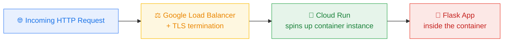
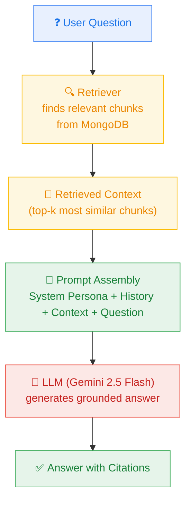
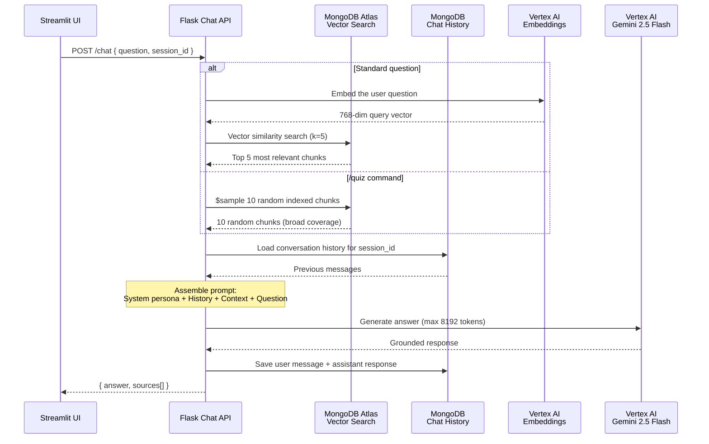
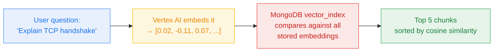
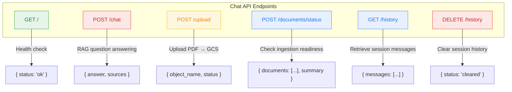

# 🤖 Chat API — RAG-Powered Academic Tutor Backend

## What Is Cloud Run?

**Cloud Run** is Google's fully managed platform for running containerized applications. You give Google a Docker container, and Cloud Run handles deployment, TLS certificates, scaling, load balancing, and even scaling down to zero when there's no traffic.

Unlike Cloud Functions (which run a single function in response to an event), Cloud Run runs a _full web server_ — in our case a Flask application — that can handle any number of HTTP endpoints, maintain in-memory state, and manage long-lived connections.



Key Cloud Run properties:

| Property | What It Means |
|---|---|
| **Container-based** | You ship a Docker image; Cloud Run runs it |
| **Fully managed** | No VMs, no Kubernetes cluster to maintain |
| **Auto-scales** | 0 → N instances based on traffic |
| **Pay-per-use** | Billed only while handling requests (or minimum instances if configured) |
| **HTTPS by default** | Every service gets a `*.run.app` URL with managed TLS |

---

## What Is RAG? (Retrieval-Augmented Generation)

The Chat API implements the **RAG pattern** — the dominant architecture for building AI applications that need to answer questions grounded in private data.

The core insight of RAG is simple: **don't ask the LLM to memorize your documents — give it the relevant excerpts at query time.**



Without RAG, an LLM can only use what it learned during training. With RAG, we _augment_ the generation step with freshly _retrieved_ knowledge — in our case, chunks from the student's own lecture PDFs.

---

## How the Chat API Implements RAG

### The full request lifecycle

Here's what happens from the moment a user sends a question to the moment they see an answer:



### Step-by-step walkthrough

**1. The request arrives at `POST /chat`**

```python
@app.route("/chat", methods=["POST"])
def chat():
    body = request.get_json(silent=True) or {}
    question = body.get("question", "").strip()
    session_id = body.get("session_id", "default")
```

The UI sends a JSON body with two fields: the user's `question` and a `session_id` that ties together the conversation history.

**2. Retrieval — choosing the right strategy**

Not all queries should be handled the same way. The function `retrieve_context_for_question()` routes between two paths:

```python
def retrieve_context_for_question(question: str) -> tuple[str, list[str]]:
    if _is_quiz_command(question):
        sampled_records = _sample_quiz_records(sample_size=10)
        return _build_context_and_sources(sampled_records)

    vs = get_vector_store()
    docs = vs.similarity_search(question, k=5)
    return _build_context_and_sources(docs)
```

- **Standard questions** → the question text is embedded into a 768-dim vector and compared against all stored chunk vectors using **cosine similarity**. The top 5 most similar chunks are returned. This is powered by **MongoDB Atlas Vector Search**.

- **`/quiz` command** → vector search on the literal string "/quiz" would be meaningless (no document chunk is semantically similar to the word "quiz"). Instead, we use MongoDB's `$sample` aggregation stage to randomly pick 10 chunks, giving Gemini broad material to generate a diverse quiz.

**3. Vector search — how it works under the hood**

MongoDB Atlas Vector Search maintains a special index (`vector_index`) on the `vectorEmbedding` field of the `context` collection. When we call `similarity_search()`, LangChain:

1. Sends the user's question to Vertex AI's `text-embedding-005` model
2. Receives a 768-dimensional vector back
3. Passes that vector to MongoDB's `$vectorSearch` aggregation stage
4. MongoDB compares it against all stored vectors using cosine similarity
5. Returns the top-k documents, ranked by relevance



**4. Prompt assembly — the system persona**

The retrieved context is injected into a carefully crafted system prompt that defines SmartStudy's tutor persona. The prompt template has three parts:

```
┌─────────────────────────────────────────┐
│ SYSTEM: SmartStudy tutor persona        │
│   - Cite sources with filename + page   │
│   - Never hallucinate                   │
│   - Use structured answers              │
│   - Be pedagogical                      │
│   - Quiz mode rules                     │
│   - {context} ← injected chunks         │
├─────────────────────────────────────────┤
│ HISTORY: previous conversation turns    │
│   (loaded from MongoDB chat_history)    │
├─────────────────────────────────────────┤
│ HUMAN: the current question             │
└─────────────────────────────────────────┘
```

This is built using LangChain's `ChatPromptTemplate`:

```python
prompt = ChatPromptTemplate.from_messages([
    ("system", TUTOR_SYSTEM_PROMPT),        # includes {context} placeholder
    MessagesPlaceholder(variable_name="history"),
    ("human", "{question}"),
])
```

**5. LLM generation**

The assembled prompt is sent to **Gemini 2.5 Flash** via Vertex AI. The model generates a response grounded in the provided context, with `max_output_tokens=8192` to allow for detailed quiz responses:

```python
llm = ChatVertexAI(
    model_name="gemini-2.5-flash",
    project=GCP_PROJECT_ID,
    location=GCP_REGION,
    temperature=0.3,
    max_output_tokens=8192,
)
```

**6. Conversation memory**

LangChain's `RunnableWithMessageHistory` automatically saves each exchange (user question + assistant answer) to MongoDB's `chat_history` collection, keyed by `session_id`. On the next request with the same session, the full conversation is reloaded:

```python
rag_chain = RunnableWithMessageHistory(
    base_chain,
    get_session_history,           # returns MongoDBChatMessageHistory
    input_messages_key="question",
    history_messages_key="history",
)
```

---

## Other API Endpoints

### Source & Page Extraction

The Chat API needs to extract citation metadata (source filename and page number) from retrieved chunks to display references like _"lecture3.pdf, p.5"_.

Because we store `source` and `page` as **flat top-level fields** in MongoDB (alongside `textChunk` and `vectorEmbedding`), `MongoDBAtlasVectorSearch` maps them directly into `Document.metadata` on retrieval. This makes extraction trivial:

```python
def _extract_source_and_page(doc):
    """Extract source and page from a LangChain Document's metadata."""
    metadata = doc.metadata or {}
    source = metadata.get("source", "unknown")
    raw_page = metadata.get("page")
    page_display = _normalize_page_display(raw_page)
    return source, page_display
```

A parallel function `_extract_source_and_page_from_record()` handles raw MongoDB dicts (used in `/quiz` mode where we bypass LangChain's retriever and query MongoDB directly with `$sample`):

```python
def _extract_source_and_page_from_record(record: dict):
    """Extract source and page from a raw MongoDB document."""
    source = record.get("source", "unknown")
    raw_page = record.get("page")
    page_display = _normalize_page_display(raw_page)
    return source, page_display
```

Both functions read the same flat fields — no nesting, no fallback chains, no `$or` queries. The ingestion function writes `source` and `page` at the top level, and the Chat API reads them directly.

---

The Chat API isn't just a chat endpoint — it also handles file uploads, document status checks, and history management:



### `POST /upload` — File upload gateway

The UI sends PDFs here. The API validates the file (PDF only, ≤ 25 MB, non-empty), generates a unique object name, and uploads it to GCS. This triggers the Cloud Function ingestion pipeline automatically:

```python
object_name = f"{GCS_UPLOAD_PREFIX}/{base_name}-{uuid8}.pdf"
blob.upload_from_string(file_bytes, content_type="application/pdf")
```

### `POST /documents/status` — Ingestion readiness polling

After uploading, the UI needs to know when ingestion is complete. This endpoint checks whether chunks exist in MongoDB for each requested document:

```python
chunk_count = collection.count_documents({"source": object_name})
# chunk_count > 0 → "ready"
# chunk_count == 0 and file exists in GCS → "processing"
# chunk_count == 0 and file not in GCS → "not_found"
```

### `GET /history` and `DELETE /history` — Session management

- **GET** returns all stored messages for a session, normalizing role names (`human` → `user`, `ai` → `assistant`) so the UI can display them directly.
- **DELETE** clears the conversation history when the user starts a new session.

---

## Containerization with Docker

The Chat API is packaged as a Docker container for Cloud Run:

```dockerfile
FROM python:3.12-slim
WORKDIR /app
COPY requirements.txt .
RUN pip install --no-cache-dir -r requirements.txt
COPY . .
CMD ["sh", "-c", "gunicorn --bind 0.0.0.0:${PORT:-8080} --workers 1 --threads 4 main:app"]
```

Key details:
- **Gunicorn** serves the Flask app (production-grade WSGI server)
- **`${PORT:-8080}`** — Cloud Run injects the `PORT` environment variable; we default to 8080 for local development
- **1 worker, 4 threads** — appropriate for I/O-bound workloads (waiting on MongoDB, Vertex AI, GCS)

---

## LangChain — The Orchestration Framework

LangChain is the glue that ties together retrieval, prompting, LLM calls, and memory. Here's how the components map:

| LangChain Component | What It Does in SmartStudy |
|---|---|
| `MongoDBAtlasVectorSearch` | Wraps MongoDB as a vector retriever |
| `VertexAIEmbeddings` | Generates query vectors via Vertex AI |
| `ChatVertexAI` | Sends prompts to Gemini 2.5 Flash |
| `ChatPromptTemplate` | Structures the system + history + question prompt |
| `MongoDBChatMessageHistory` | Persists conversation turns in MongoDB |
| `RunnableWithMessageHistory` | Automatically loads/saves history per session |
| `StrOutputParser` | Extracts the text response from the LLM output |

The entire chain is expressed as a single LCEL (LangChain Expression Language) pipeline:

```python
base_chain = prompt | llm | StrOutputParser()
```

This reads as: _"take the prompt, pipe it to the LLM, parse the output as a string."_

---

## File Structure

```
chat_api/
├── main.py              # Flask app, all endpoints, RAG chain, retrieval logic
├── requirements.txt     # Python dependencies
└── Dockerfile           # Container definition for Cloud Run
```

---

## Deployment Configuration

```
Service:     smartstudy-chat-api
Platform:    Cloud Run (fully managed)
Region:      europe-west1
Image:       Built from chat_api/Dockerfile
URL:         https://smartstudy-chat-api-omcgx7zncq-ew.a.run.app
Port:        8080 (injected via PORT env var)
```

Environment variables are set at deploy time and include:
- MongoDB connection string and collection names
- GCP project ID and region
- GCS bucket name and upload prefix
- Vertex AI model identifiers

---

## Key Cloud Concepts Demonstrated

| Concept | How It Appears Here |
|---|---|
| **Containerized microservice** | Flask app packaged in Docker, deployed to Cloud Run |
| **Serverless auto-scaling** | Cloud Run scales instances based on incoming request load |
| **RAG (Retrieval-Augmented Generation)** | Retrieve → Contextualize → Generate pattern |
| **Vector search** | MongoDB Atlas cosine-similarity search on 768-dim embeddings |
| **Managed AI services** | Vertex AI for both embeddings and LLM generation — no GPU management |
| **Managed database** | MongoDB Atlas handles replication, sharding, and indexing |
| **Object storage gateway** | API uploads PDFs to GCS, triggering downstream event-driven processing |
| **Stateless service + external state** | The API itself is stateless; all state lives in MongoDB and GCS |
| **Conversation persistence** | Chat history stored in MongoDB, rehydrated across sessions |
| **Service-to-service communication** | UI → Chat API → GCS / MongoDB / Vertex AI |
