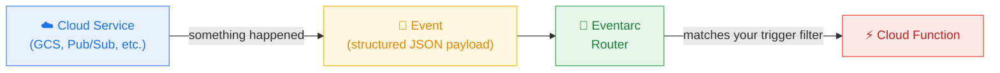
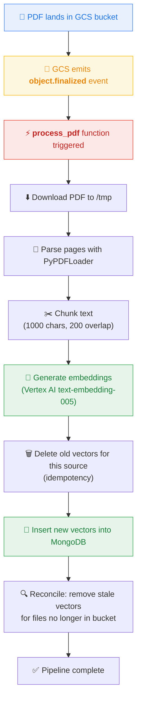
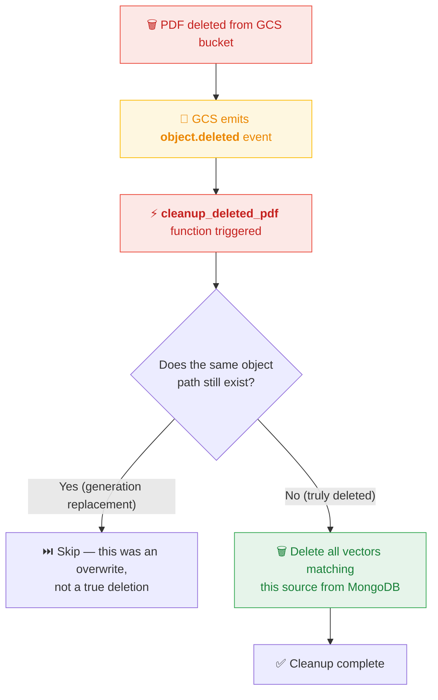

# ☁️ Cloud Function — Event-Driven PDF Ingestion & Cleanup

## What Is a Google Cloud Function?

A **Cloud Function** is a lightweight, single-purpose piece of code that Google runs for you _without you managing any server_. You don't provision a VM, configure an OS, or install a web server. You hand Google a Python file, tell it _"run this whenever X happens"_, and Google takes care of the rest — spinning up an execution environment, running your code, then scaling back down to zero when there's nothing to do.

Cloud Functions follow the **Functions-as-a-Service (FaaS)** model, one of the purest forms of serverless computing:

| Traditional Server | Cloud Function |
|---|---|
| You manage the machine, OS, and runtime | Google manages everything |
| Runs 24/7 whether or not there's work | Runs only when triggered, then sleeps |
| You pay for uptime | You pay per invocation (fractions of a cent) |
| You handle scaling yourself | Google auto-scales from 0 to N instances |

SmartStudy uses **Gen 2 Cloud Functions**, which are built on top of Cloud Run under the hood. Gen 2 gives us longer timeouts (up to 60 minutes), more memory (up to 32 GiB), and concurrency support — all important for processing large PDFs.

---

## What Is an Event? (And Why It Matters)

In cloud architectures, an **event** is a structured notification that _something happened_. Events are the connective tissue of serverless systems — instead of one service polling another in a loop asking _"did anything change?"_, the cloud platform emits an event the instant something occurs, and your function reacts to it.

Google Cloud uses **Eventarc** to route events from over 90 Google services to Cloud Functions. The pattern looks like this:



Each event arrives as a **CloudEvent** — an industry-standard envelope that carries:
- **type** — what happened (e.g. `google.cloud.storage.object.v1.finalized`)
- **source** — where it happened (e.g. the bucket name)
- **data** — the payload (e.g. the uploaded file's metadata: name, size, content type)

Your function receives this CloudEvent object and can inspect its `.data` dictionary to decide what to do.

---

## How SmartStudy Uses Cloud Functions

SmartStudy deploys **two** Cloud Functions, both triggered by events from the same GCS bucket (`smartstudy-pdfs-491919`):

| Function | Trigger Event | Purpose |
|---|---|---|
| `smartstudy-ingest` | `object.v1.finalized` (file created/overwritten) | Ingest the PDF → chunks → embeddings → MongoDB |
| `smartstudy-cleanup` | `object.v1.deleted` (file removed) | Remove all related vectors from MongoDB |

Together, they ensure that MongoDB's vector knowledge base is **always in sync** with whatever PDFs exist in the bucket — without any manual intervention.

---

## The Ingestion Pipeline (step by step)

When a student uploads a PDF through the UI, it lands in the GCS bucket. The moment the upload completes, GCS emits a `finalized` event, and the ingestion function wakes up:



### Walking through the code

**1. Entry point — `process_pdf(cloud_event)`**

The `@functions_framework.cloud_event` decorator tells the Functions Framework that this function expects a CloudEvent. The framework deserializes the incoming HTTP request into a CloudEvent object and calls our function with it:

```python
@functions_framework.cloud_event
def process_pdf(cloud_event):
    data = cloud_event.data
    bucket_name = data["bucket"]
    blob_name = data["name"]
```

The `data` dictionary contains the GCS object metadata. We extract the **bucket name** and **object name** (the file path inside the bucket).

**2. Guard clause — skip non-PDFs**

The trigger fires for _any_ file uploaded to the bucket. We only care about PDFs:

```python
if not blob_name.lower().endswith(".pdf"):
    print(f"Skipping non-PDF file: {blob_name}")
    return
```

**3. Download to local disk**

Cloud Functions have a writable `/tmp` directory. We download the PDF there so LangChain's `PyPDFLoader` can read it:

```python
download_pdf_from_gcs(bucket_name, blob_name, tmp_path)
```

**4. Extract text and chunk it**

We use LangChain's `PyPDFLoader` to read the PDF page by page, then `RecursiveCharacterTextSplitter` to break the text into overlapping chunks of ~1000 characters. The overlap ensures that sentences split across chunk boundaries still appear in at least one chunk:

```python
session_id = extract_session_id_from_object_name(blob_name)
chunks = extract_and_chunk(tmp_path, source_name=blob_name, session_id=session_id)
```

**5. Generate embeddings**

Each text chunk is sent to **Vertex AI's `text-embedding-005`** model, which returns a 768-dimensional vector — a numerical fingerprint of the chunk's semantic meaning. We batch these in groups of 250 to respect API limits:

```python
embeddings = generate_embeddings(chunks)
```

**6. Idempotent upsert**

Before inserting, we delete any existing vectors for this exact source path. This makes the function **idempotent** — if the same PDF is uploaded twice (overwrite), we don't end up with duplicate chunks:

```python
deleted_for_source = delete_vectors_for_source(blob_name)
upsert_to_mongodb(chunks, embeddings)
```

**7. Reconciliation safety net**

As a final step, we scan the entire MongoDB collection and compare it against what's currently in the bucket. Any vectors whose source file no longer exists are removed. This catches edge cases where a delete event was missed:

```python
deleted_stale = reconcile_context_with_bucket(bucket_name)
```

---

## The Cleanup Pipeline

When a PDF is deleted from the bucket (manually or programmatically), GCS emits a `deleted` event:



### The overwrite-race guard

When you _overwrite_ a file in GCS (upload a new version with the same name), GCS emits **both** a `deleted` event for the old generation **and** a `finalized` event for the new one. Without a guard, the cleanup function could delete vectors that the ingestion function is about to recreate — a race condition.

Our guard checks whether the object path still exists before deleting vectors:

```python
if bucket.blob(blob_name).exists():
    print("Skipping cleanup: object path still exists (likely generation replacement).")
    return
```

---

## Singleton Clients — Why They Matter

Cloud Functions reuse the same process instance across multiple invocations (a concept called **warm starts**). Creating a new MongoDB client or GCS client on every invocation would waste time and open unnecessary connections.

Instead, we initialize clients once at the module level and reuse them:

```python
mongo_client: MongoClient | None = None

def get_mongo_client() -> MongoClient:
    global mongo_client
    if mongo_client is None:
        mongo_client = MongoClient(MONGODB_URI)
    return mongo_client
```

On the **first** invocation (cold start), the client is created. On all subsequent invocations in the same instance, the existing client is returned instantly. This is a standard best-practice pattern for Cloud Functions.

---

## MongoDB Document Shape

Each chunk inserted into the `context` collection has a clean five-field structure:

```json
{
  "_id": "ObjectId(...)",
  "textChunk": "The TCP three-way handshake begins with a SYN packet...",
  "vectorEmbedding": [0.012, -0.091, 0.034, "... (768 floats)"],
  "source": "uploads/123e4567-e89b-12d3-a456-426614174000/networking-lecture-a1b2c3d4.pdf",
  "page": 11,
  "session_id": "123e4567-e89b-12d3-a456-426614174000"
}
```

| Field | Purpose |
|---|---|
| `textChunk` | The raw text of this chunk (used for retrieval display and RAG context) |
| `vectorEmbedding` | 768-dimensional vector from Vertex AI `text-embedding-005` (used for similarity search) |
| `source` | The GCS object path — used for idempotent delete/replace and citation display |
| `page` | 0-based page index from PyPDFLoader (the Chat API converts to 1-based for display) |
| `session_id` | The session folder extracted from the GCS object path — used for retrieval isolation |

This flat layout keeps ingestion and retrieval simple. The Chat API filters chunks by `session_id`, cites them by `source` + `page`, and status/delete/reconcile operations still use `source` as the canonical object-path field.

---

## Deployment Configuration

```
Function:     smartstudy-ingest / smartstudy-cleanup
Runtime:      Python 3.12
Gen:          Gen 2
Region:       europe-west1
Memory:       1 GiB
Timeout:      300 seconds (5 minutes)
Trigger:      Eventarc → GCS bucket events
```

The function has no Dockerfile — Google provides the runtime. We just supply `main.py` and `requirements.txt`, and the Functions Framework handles the HTTP-to-CloudEvent translation.

---

## File Structure

```
cloud_function/
├── main.py              # Both entry points + all pipeline helpers
└── requirements.txt     # Python dependencies (functions-framework, langchain, etc.)
```

---

## Key Cloud Concepts Demonstrated

| Concept | How It Appears Here |
|---|---|
| **Serverless / FaaS** | No server management; code runs on-demand in response to events |
| **Event-driven architecture** | GCS events trigger ingestion and cleanup automatically |
| **CloudEvents standard** | Functions receive industry-standard event envelopes |
| **Cold start vs warm start** | Singleton clients optimize warm-start reuse |
| **Idempotency** | Re-uploading the same PDF produces the same result (old vectors deleted first) |
| **Eventual consistency** | Reconciliation scan catches missed events as a safety net |
| **Managed AI services** | Vertex AI embedding model called as an API, no GPU management |
| **Separation of concerns** | Ingestion logic is fully decoupled from the Chat API and UI |
