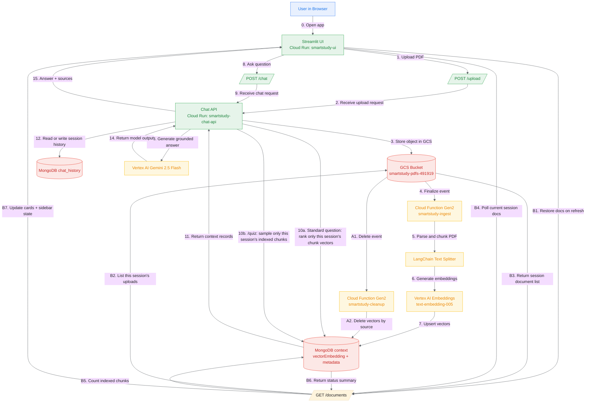

# SmartStudy Architecture - Developer Deep Dive

Last updated: 2026-04-27

This document is the technical reference for the current production setup and data flow.

## 1) Current Deployed Topology (Live)

### Core resources

| Layer | Resource | Region | Status / Notes |
|---|---|---|---|
| GCP Project | `smart-study-491919` | `europe-west1` | Active |
| GCS Bucket | `gs://smartstudy-pdfs-491919` | `EUROPE-WEST1` | `uniform_bucket_level_access=True`, `public_access_prevention=inherited` |
| Cloud Function (ingest) | `smartstudy-ingest` | `europe-west1` | Gen2, trigger=`google.cloud.storage.object.v1.finalized`, memory=`1Gi`, timeout=`300s` |
| Cloud Function (cleanup) | `smartstudy-cleanup` | `europe-west1` | Gen2, trigger=`google.cloud.storage.object.v1.deleted`, memory=`1Gi`, timeout=`300s` |
| Cloud Run (Chat API) | `smartstudy-chat-api` | `europe-west1` | URL: `https://smartstudy-chat-api-959221029360.europe-west1.run.app` |
| Cloud Run (UI) | `smartstudy-ui` | `europe-west1` | URL: `https://smartstudy-ui-959221029360.europe-west1.run.app` |
| MongoDB Atlas DB | `smartstudy` | Atlas | Collections: `context`, `chat_history` |
| MongoDB Vector Index | `vector_index` | Atlas | Collection=`context`, field=`vectorEmbedding`, dim=`768`, similarity=`cosine` |

### Runtime env config (active conventions)

From `.env` + defaults:

- `GCP_PROJECT_ID=smart-study-491919`
- `GCP_REGION=europe-west1`
- `GCS_BUCKET_NAME=smartstudy-pdfs-491919`
- `MONGODB_URI` explicitly enables `retryWrites=true`, `w=majority`, and `appName=smartstudy`
- `MONGODB_DB_NAME=smartstudy`
- `MONGODB_COLLECTION=context`
- `MONGODB_CHAT_HISTORY_COLLECTION=chat_history`
- `MONGODB_VECTOR_INDEX_NAME=vector_index`
- `VERTEX_AI_EMBEDDING_MODEL=text-embedding-005`
- `VERTEX_AI_LLM_MODEL=gemini-2.5-flash`
- `GCS_UPLOAD_PREFIX=uploads` (default)
- `MAX_UPLOAD_MB=25` (default)
- `UPLOAD_TIMEOUT_SECONDS=180` (UI default)
- `STATUS_POLL_INTERVAL_SECONDS=4` (UI default)
- `STATUS_REQUEST_TIMEOUT_SECONDS=15` (UI default)
- `HISTORY_REQUEST_TIMEOUT_SECONDS=15` (UI default)
- Gemini generation cap: `max_output_tokens=8192`

## 2) System Flow (Detailed)



## 3) Request/Processing Paths

### A) Upload path (user-triggered)

1. User selects one or more PDFs in the Streamlit sidebar.
2. Streamlit submits the selected files as a batch (one request per file) to `POST /upload`.
3. Chat API validates:
   - file present
   - filename non-empty
   - extension `.pdf`
   - size <= `MAX_UPLOAD_MB`
4. Chat API computes:
   - `content_sha256`: SHA-256 hash of the uploaded bytes
   - `document_title_key`: normalized filename key used for same-title versioning
5. Chat API scans the current session folder:
   - if the same `content_sha256` already exists, no new object is written and the existing object is reused
   - if the same `document_title_key` exists with different content, the new object is accepted and the previous same-title object plus vectors are deleted
6. New uploads are written to:
   - `gs://smartstudy-pdfs-491919/uploads/<session_id>/<secure_name>-<uuid8>.pdf`
7. Chat API stores GCS metadata including `session_id`, `original_name`, `content_sha256`, and `document_title_key`.
8. Chat API returns upload metadata including `session_id`, `object_name`, `source_name`, `upload_id`, `upload_action`, and replacement details.
9. GCS emits `object.finalized` events for new uploads.
10. `smartstudy-ingest` executes ingestion per newly uploaded object.

### B) Document rehydration + readiness path (`GET /documents`)

1. Streamlit mirrors the active `session_id` to `?sid=...`.
2. On page load, the UI calls `GET /documents?session_id=<sid>` once to rebuild the Documents tab from the session-scoped GCS folder.
3. The Chat API lists objects only from `uploads/<session_id>/...` and returns their current status summary.
4. Streamlit stores those `object_name` values in session state.
5. While any file is pending, UI polls `GET /documents?session_id=<sid>` at `STATUS_POLL_INTERVAL_SECONDS`.
6. Chat API checks readiness per object by:
   - counting matching chunks in Mongo `context`
   - optionally checking object existence in GCS
7. Chat API returns per-document status (`ready`, `processing`, `not_found`, `invalid`) plus summary counts.
8. UI compares a stable document-state signature and only triggers a full rerun when a meaningful status change happened, which keeps the sidebar badges and chat welcome state in sync.

### C) Document delete path (`DELETE /documents`)

1. User clicks `Delete` on a document card in the Documents tab.
2. Streamlit calls `DELETE /documents?session_id=<sid>&object_name=<gcs_path>`.
3. Chat API validates that the object belongs to the active session.
4. Chat API deletes the object from the session-scoped GCS folder.
5. Chat API immediately deletes indexed chunks where both `source` and `session_id` match the removed object.
6. UI refreshes `GET /documents` and removes the card from the current session view.

### D) Ingestion path (`smartstudy-ingest`)

Pipeline in `cloud_function/main.py -> process_pdf`:

1. Confirm the object still exists in GCS before starting work.
2. Download PDF from GCS to `/tmp`.
3. Parse pages with `PyPDFLoader`.
4. Chunk text with `RecursiveCharacterTextSplitter`:
   - `chunk_size=1000`
   - `chunk_overlap=200`
5. Generate embeddings in batches of 250 using Vertex AI.
6. Enforce idempotency per object path:
   - `delete_vectors_for_source(blob_name)` before insert.
7. Confirm the object still exists in GCS again just before upsert, so a mid-ingestion delete does not recreate vectors for a removed document.
8. Insert chunk docs into Mongo `context`, including the extracted `session_id`.
9. Reuse shared module-level MongoDB and GCS clients inside the warm function instance to avoid rebuilding clients on every helper call.
10. Reconcile stale vectors against current bucket content:
   - remove docs whose `source` no longer exists in GCS.

### E) Delete-sync path (`smartstudy-cleanup`)

Pipeline in `cloud_function/main.py -> cleanup_deleted_pdf`:

1. Triggered on `google.cloud.storage.object.v1.deleted`.
2. Ignore non-PDF events.
3. Overwrite-race guard:
   - if same object path still exists (generation replacement), skip cleanup.
4. If truly deleted:
   - `delete_many` vectors where `source` matches blob path.

### F) Chat path (`POST /chat`)

1. Read user question and `session_id`.
2. Check for short social prompts such as `Hello`, `How are you?`, or `Thank you`; these bypass retrieval and return direct source-free replies.
3. Otherwise choose retrieval strategy:
   - normal questions: load this session's indexed chunks and rank them by cosine similarity against the current query embedding
   - `/quiz`: randomly sample 10 indexed chunk records from Mongo `context` for this same session only
4. If the best similarity score is below the minimum context threshold, or no session chunks exist, return a direct no-context answer with no sources.
5. Normalize source/page metadata for citations.
6. Compose prompt:
   - system tutor persona
   - conversation history (`MongoDBChatMessageHistory`)
   - retrieved context
7. Generate answer with Gemini 2.5 Flash using `max_output_tokens=8192`.
8. Filter the source summary against the generated answer, keeping only labels whose filename and page are cited inline.
9. Return:
   - `answer`
   - deduplicated, cited-only `sources` list

### G) Session rehydration (`GET /history` + `GET /documents` + UI `sid`)

1. Streamlit keeps a stable `session_id` and mirrors it to `?sid=...`.
2. On page load, UI calls `GET /history?session_id=<sid>` once.
3. On that same page load, UI also calls `GET /documents?session_id=<sid>` once.
4. Chat API reads `MongoDBChatMessageHistory` from `chat_history`.
5. Chat API lists GCS objects only from the active session folder.
6. If either restore request fails, the UI leaves the corresponding hydration flag unset so the next rerun can retry instead of treating the failed load as complete.
7. UI rehydrates both the conversation and the Documents tab before rendering them, which restores the same state on refresh or when reopening the same `?sid=...` link.
8. If URL `sid` changes or is absent, UI intentionally starts a new session with empty chat and empty document state.
9. Temporary transport errors in the UI are not persisted as assistant messages.

## 4) Data Model (Current)

### MongoDB `context` document (effective shape)

```json
{
  "_id": "ObjectId(...)",
  "textChunk": "chunk text",
  "vectorEmbedding": [0.012, -0.091, "..."],
  "source": "uploads/123e4567-e89b-12d3-a456-426614174000/my-file-a1b2c3d4.pdf",
  "page": 3,
  "session_id": "123e4567-e89b-12d3-a456-426614174000"
}
```

Notes:
- `source`, `page`, and `session_id` are stored at the top level for simple filtering and status checks.
- `page` is stored as the raw 0-based index from PyPDFLoader; the Chat API's `_normalize_page_display()` converts to 1-based for citations.

### MongoDB `chat_history`

- Managed by `MongoDBChatMessageHistory`.
- Keyed by `session_id`.
- Persists backend conversation state.

### GCS object metadata

New uploads store these metadata fields:

```json
{
  "session_id": "123e4567-e89b-12d3-a456-426614174000",
  "original_name": "lecture.pdf",
  "content_sha256": "e3b0c442...",
  "document_title_key": "lecture.pdf"
}
```

Notes:
- `content_sha256` prevents duplicate copies of byte-identical PDFs within one session.
- `document_title_key` allows same-title uploads with new bytes to replace older same-title versions.
- Older objects without hash metadata are hashed lazily by the Chat API the next time an upload scans that session.

## 5) Operational Commands (Dev Runbook)

### Verify deployments

```bash
gcloud run services describe smartstudy-chat-api --region=europe-west1 --project=smart-study-491919 --format="value(status.url)"
gcloud run services describe smartstudy-ui --region=europe-west1 --project=smart-study-491919 --format="value(status.url)"
gcloud functions describe smartstudy-ingest --gen2 --region=europe-west1 --project=smart-study-491919
gcloud functions describe smartstudy-cleanup --gen2 --region=europe-west1 --project=smart-study-491919
```

### List session documents via API

```bash
curl "https://smartstudy-chat-api-959221029360.europe-west1.run.app/documents?session_id=YOUR_SESSION_ID"
```

### Check document readiness via API

```bash
curl -X POST "https://smartstudy-chat-api-959221029360.europe-west1.run.app/documents/status" \
  -H "Content-Type: application/json" \
  -d '{
    "session_id": "YOUR_SESSION_ID",
    "documents": [
      { "object_name": "uploads/YOUR_SESSION_ID/example-a1b2c3d4.pdf" }
    ]
  }'
```

### Delete one session document via API

```bash
curl -X DELETE "https://smartstudy-chat-api-959221029360.europe-west1.run.app/documents?session_id=YOUR_SESSION_ID&object_name=uploads/YOUR_SESSION_ID/example-a1b2c3d4.pdf"
```

### Trigger ingestion manually

```bash
gcloud storage cp my.pdf gs://smartstudy-pdfs-491919/uploads/YOUR_SESSION_ID/my.pdf --project=smart-study-491919
gcloud functions logs read smartstudy-ingest --region=europe-west1 --limit=100
```

### Trigger cleanup manually

```bash
gcloud storage rm gs://smartstudy-pdfs-491919/uploads/YOUR_SESSION_ID/my.pdf --project=smart-study-491919
gcloud functions logs read smartstudy-cleanup --region=europe-west1 --limit=100
```

### Redeploy functions

```bash
# Ingest
gcloud functions deploy smartstudy-ingest \
  --gen2 \
  --project=smart-study-491919 \
  --region=europe-west1 \
  --runtime=python312 \
  --source=. \
  --entry-point=process_pdf \
  --trigger-event-filters=type=google.cloud.storage.object.v1.finalized \
  --trigger-event-filters=bucket=smartstudy-pdfs-491919 \
  --memory=1Gi \
  --timeout=300s

# Cleanup
gcloud functions deploy smartstudy-cleanup \
  --gen2 \
  --project=smart-study-491919 \
  --region=europe-west1 \
  --runtime=python312 \
  --source=. \
  --entry-point=cleanup_deleted_pdf \
  --trigger-event-filters=type=google.cloud.storage.object.v1.deleted \
  --trigger-event-filters=bucket=smartstudy-pdfs-491919 \
  --memory=1Gi \
  --timeout=300s
```

## 6) Current Caveats and Planned Improvements

- Session continuity is URL-session based (`sid`) rather than account-based identity.
- Anyone with the same `sid` can view the same chat history and session document namespace; authentication is not enforced yet.
- Source list may include multiple active files if user uploads several PDFs; expected behavior.
- Readiness and sidebar sync are inferred from indexed chunk presence and storage checks, so status is near-real-time but event-driven.
- Upload deduplication only detects exact byte-identical PDFs. Near-duplicate content with different PDF bytes is not collapsed.
- `reconcile_context_with_bucket()` still performs a full bucket + collection consistency scan after each upload as a safety net; useful for resilience at demo scale, but not the most scalable long-term design.
- Optional future hardening:
  - add authenticated document ownership instead of URL-session isolation alone
  - add a dedicated documents-status collection for richer pipeline states
  - migrate deprecated embedding wrapper if required by future LangChain versions
