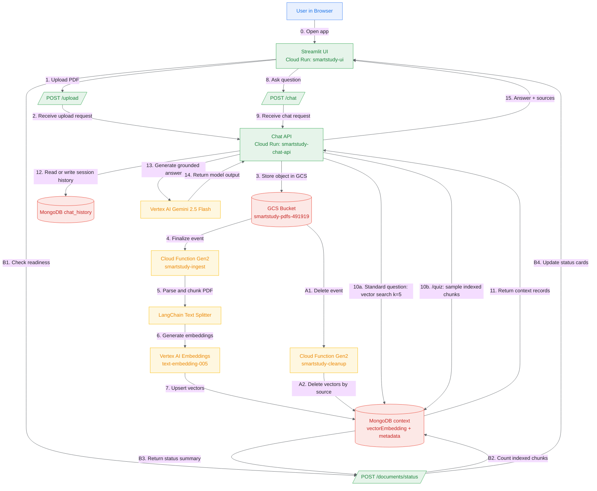

# SmartStudy Architecture - Developer Deep Dive

Last updated: 2026-04-02

This document is the technical reference for the current production setup and data flow.

## 1) Current Deployed Topology (Live)

### Core resources

| Layer | Resource | Region | Status / Notes |
|---|---|---|---|
| GCP Project | `smart-study-491919` | `europe-west1` | Active |
| GCS Bucket | `gs://smartstudy-pdfs-491919` | `EUROPE-WEST1` | `uniform_bucket_level_access=True`, `public_access_prevention=inherited` |
| Cloud Function (ingest) | `smartstudy-ingest` | `europe-west1` | Gen2, trigger=`google.cloud.storage.object.v1.finalized`, memory=`1Gi`, timeout=`300s` |
| Cloud Function (cleanup) | `smartstudy-cleanup` | `europe-west1` | Gen2, trigger=`google.cloud.storage.object.v1.deleted`, memory=`1Gi`, timeout=`300s` |
| Cloud Run (Chat API) | `smartstudy-chat-api` | `europe-west1` | URL: `https://smartstudy-chat-api-omcgx7zncq-ew.a.run.app` |
| Cloud Run (UI) | `smartstudy-ui` | `europe-west1` | URL: `https://smartstudy-ui-omcgx7zncq-ew.a.run.app` |
| MongoDB Atlas DB | `smartstudy` | Atlas | Collections: `context`, `chat_history` |
| MongoDB Vector Index | `vector_index` | Atlas | Collection=`context`, field=`vectorEmbedding`, dim=`768`, similarity=`cosine` |

### Runtime env config (active conventions)

From `.env` + defaults:

- `GCP_PROJECT_ID=smart-study-491919`
- `GCP_REGION=europe-west1`
- `GCS_BUCKET_NAME=smartstudy-pdfs-491919`
- `MONGODB_URI` explicitly enables `retryWrites=true`, `w=majority`, and `appName=smartstudy`
- `MONGODB_DB_NAME=smartstudy`
- `MONGODB_COLLECTION=context`
- `MONGODB_CHAT_HISTORY_COLLECTION=chat_history`
- `MONGODB_VECTOR_INDEX_NAME=vector_index`
- `VERTEX_AI_EMBEDDING_MODEL=text-embedding-005`
- `VERTEX_AI_LLM_MODEL=gemini-2.5-flash`
- `GCS_UPLOAD_PREFIX=uploads` (default)
- `MAX_UPLOAD_MB=25` (default)
- `UPLOAD_TIMEOUT_SECONDS=180` (UI default)
- `STATUS_POLL_INTERVAL_SECONDS=4` (UI default)
- `STATUS_REQUEST_TIMEOUT_SECONDS=15` (UI default)
- `HISTORY_REQUEST_TIMEOUT_SECONDS=15` (UI default)
- Gemini generation cap: `max_output_tokens=8192`

## 2) System Flow (Detailed)



## 3) Request/Processing Paths

### A) Upload path (user-triggered)

1. User selects one or more PDFs in the Streamlit sidebar.
2. Streamlit submits the selected files as a batch (one request per file) to `POST /upload`.
3. Chat API validates:
   - file present
   - filename non-empty
   - extension `.pdf`
   - size <= `MAX_UPLOAD_MB`
4. Chat API writes each object to:
   - `gs://smartstudy-pdfs-491919/uploads/<secure_name>-<uuid8>.pdf`
5. Chat API returns upload metadata including `object_name`, `source_name`, and `upload_id`.
6. GCS emits `object.finalized` events.
7. `smartstudy-ingest` executes ingestion per uploaded object.

### B) Readiness status path (`POST /documents/status`)

1. Streamlit stores uploaded `object_name` values in session state.
2. While any file is pending, UI polls `POST /documents/status` at `STATUS_POLL_INTERVAL_SECONDS`.
3. Chat API checks readiness per object by:
   - counting matching chunks in Mongo `context`
   - optionally checking object existence in GCS
4. Chat API returns per-document status (`ready`, `processing`, `not_found`, `invalid`) plus summary counts.
5. UI updates each document card in real time until ingestion is complete.

### C) Ingestion path (`smartstudy-ingest`)

Pipeline in `cloud_function/main.py -> process_pdf`:

1. Download PDF from GCS to `/tmp`.
2. Parse pages with `PyPDFLoader`.
3. Chunk text with `RecursiveCharacterTextSplitter`:
   - `chunk_size=1000`
   - `chunk_overlap=200`
4. Generate embeddings in batches of 250 using Vertex AI.
5. Enforce idempotency per object path:
   - `delete_vectors_for_source(blob_name)` before insert.
6. Insert chunk docs into Mongo `context`.
7. Reuse shared module-level MongoDB and GCS clients inside the warm function instance to avoid rebuilding clients on every helper call.
8. Reconcile stale vectors against current bucket content:
   - remove docs whose `source` no longer exists in GCS.

### D) Delete-sync path (`smartstudy-cleanup`)

Pipeline in `cloud_function/main.py -> cleanup_deleted_pdf`:

1. Triggered on `google.cloud.storage.object.v1.deleted`.
2. Ignore non-PDF events.
3. Overwrite-race guard:
   - if same object path still exists (generation replacement), skip cleanup.
4. If truly deleted:
   - `delete_many` vectors where `source` or `metadata.source` matches blob path.

### E) Chat path (`POST /chat`)

1. Read user question and `session_id`.
2. Choose retrieval strategy:
   - normal questions: retrieve top-k (`k=5`) chunks from Mongo vector search
   - `/quiz`: randomly sample 10 indexed chunk records from Mongo `context`
3. Normalize source/page metadata for citations.
4. Compose prompt:
   - system tutor persona
   - conversation history (`MongoDBChatMessageHistory`)
   - retrieved context
5. Generate answer with Gemini 2.5 Flash using `max_output_tokens=8192`.
6. Return:
   - `answer`
   - deduplicated `sources` list

### F) Session history rehydration (`GET /history` + UI `sid`)

1. Streamlit keeps a stable `session_id` and mirrors it to `?sid=...`.
2. On page load, UI calls `GET /history?session_id=<sid>` once.
3. Chat API reads `MongoDBChatMessageHistory` from `chat_history`.
4. API normalizes message roles to `user` / `assistant` and returns a JSON list.
5. UI rehydrates the conversation before rendering chat messages.
6. If URL `sid` changes or is absent, UI intentionally starts a new session.
7. Temporary transport errors in the UI are not persisted as assistant messages.

## 4) Data Model (Current)

### MongoDB `context` document (effective shape)

```json
{
  "_id": "ObjectId(...)",
  "textChunk": "chunk text",
  "vectorEmbedding": [0.012, -0.091, "..."],
  "source": "uploads/my-file-a1b2c3d4.pdf",
  "pageNumber": 4,
  "metadata": {
    "source": "uploads/my-file-a1b2c3d4.pdf",
    "page": 3
  }
}
```

Notes:
- `pageNumber` is stored as user-facing 1-based when available.
- Legacy docs may still rely on nested `metadata.page`; Chat API handles both.

### MongoDB `chat_history`

- Managed by `MongoDBChatMessageHistory`.
- Keyed by `session_id`.
- Persists backend conversation state.

## 5) Operational Commands (Dev Runbook)

### Verify deployments

```bash
gcloud run services describe smartstudy-chat-api --region=europe-west1 --project=smart-study-491919 --format="value(status.url)"
gcloud run services describe smartstudy-ui --region=europe-west1 --project=smart-study-491919 --format="value(status.url)"
gcloud functions describe smartstudy-ingest --gen2 --region=europe-west1 --project=smart-study-491919
gcloud functions describe smartstudy-cleanup --gen2 --region=europe-west1 --project=smart-study-491919
```

### Check document readiness via API

```bash
curl -X POST "https://smartstudy-chat-api-omcgx7zncq-ew.a.run.app/documents/status" \
  -H "Content-Type: application/json" \
  -d '{
    "documents": [
      { "object_name": "uploads/example-a1b2c3d4.pdf" }
    ]
  }'
```

### Trigger ingestion manually

```bash
gcloud storage cp my.pdf gs://smartstudy-pdfs-491919/uploads/my.pdf --project=smart-study-491919
gcloud functions logs read smartstudy-ingest --region=europe-west1 --limit=100
```

### Trigger cleanup manually

```bash
gcloud storage rm gs://smartstudy-pdfs-491919/uploads/my.pdf --project=smart-study-491919
gcloud functions logs read smartstudy-cleanup --region=europe-west1 --limit=100
```

### Redeploy functions

```bash
# Ingest
gcloud functions deploy smartstudy-ingest \
  --gen2 \
  --project=smart-study-491919 \
  --region=europe-west1 \
  --runtime=python312 \
  --source=. \
  --entry-point=process_pdf \
  --trigger-event-filters=type=google.cloud.storage.object.v1.finalized \
  --trigger-event-filters=bucket=smartstudy-pdfs-491919 \
  --memory=1Gi \
  --timeout=300s

# Cleanup
gcloud functions deploy smartstudy-cleanup \
  --gen2 \
  --project=smart-study-491919 \
  --region=europe-west1 \
  --runtime=python312 \
  --source=. \
  --entry-point=cleanup_deleted_pdf \
  --trigger-event-filters=type=google.cloud.storage.object.v1.deleted \
  --trigger-event-filters=bucket=smartstudy-pdfs-491919 \
  --memory=1Gi \
  --timeout=300s
```

## 6) Current Caveats and Planned Improvements

- Session continuity is URL-session based (`sid`) rather than account-based identity.
- Anyone with the same `sid` can view the same session history; authentication is not enforced yet.
- Source list may include multiple active files if user uploads several PDFs; expected behavior.
- Readiness polling is inferred from indexed chunk presence and storage checks, so status is near-real-time but event-driven.
- `reconcile_context_with_bucket()` still performs a full bucket + collection consistency scan after each upload as a safety net; useful for resilience at demo scale, but not the most scalable long-term design.
- Optional future hardening:
  - add document ownership filtering
  - add a dedicated documents-status collection for richer pipeline states
  - migrate deprecated embedding wrapper if required by future LangChain versions
