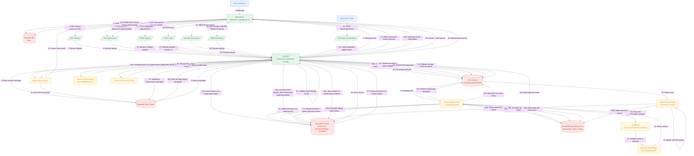

# SmartStudy Architecture - Developer Deep Dive

Last updated: 2026-05-05

This document is the technical reference for the current production setup and data flow.

## 0) Code and Documentation Map

The module READMEs explain local code behavior. This document is the canonical place for cross-service flow, deployment wiring, runtime conventions, and operational commands.

| Area | Main scripts | Local README | Deeper detail in this document |
|---|---|---|---|
| Repository setup | `README.md`, `.env.example` | [Project README](../README.md) | [Current topology](#1-current-deployed-topology-live), [operational commands](#5-operational-commands-dev-runbook) |
| Lab-to-project transition | `project-context.md`, external `../lab_code/` baseline | [Transition summary](lab-to-project-transition.md) | This document covers the final system details after that transition |
| Streamlit UI | `streamlit_app/app.py`, `streamlit_app/Dockerfile` | [Streamlit README](../streamlit_app/README.md) | [Request/processing paths](#3-requestprocessing-paths), [Cloud Run operations](#5-operational-commands-dev-runbook) |
| Chat API | `chat_api/main.py`, `chat_api/Dockerfile` | [Chat API README](../chat_api/README.md) | [Request/processing paths](#3-requestprocessing-paths), [data model](#4-data-model-current) |
| Cloud Functions | `cloud_function/main.py`, `cloud_function/requirements.txt` | [Cloud Function README](../cloud_function/README.md) | [Request/processing paths](#3-requestprocessing-paths), [Eventarc/deploy runbook](#5-operational-commands-dev-runbook) |

## 1) Current Deployed Topology (Live)

### Core resources

| Layer | Resource | Region | Status / Notes |
|---|---|---|---|
| GCP Project | `smart-study-491919` | `europe-west1` | Active |
| GCS Bucket | `gs://smartstudy-pdfs-491919` | `EUROPE-WEST1` | `uniform_bucket_level_access=True`, `public_access_prevention=inherited` |
| Cloud Function (ingest) | `smartstudy-ingest` | `europe-west1` | Gen2, trigger=`google.cloud.storage.object.v1.finalized`, memory=`1Gi`, timeout=`300s` |
| Cloud Function (cleanup) | `smartstudy-cleanup` | `europe-west1` | Gen2, trigger=`google.cloud.storage.object.v1.deleted`, memory=`1Gi`, timeout=`300s` |
| Cloud Run (Chat API) | `smartstudy-chat-api` | `europe-west1` | URL: `https://smartstudy-chat-api-959221029360.europe-west1.run.app` |
| Cloud Run (UI) | `smartstudy-ui` | `europe-west1` | URL: `https://smartstudy-ui-959221029360.europe-west1.run.app` |
| MongoDB Atlas DB | `smartstudy` | Atlas | Collections: `context`, `chat_history`, `document_status` |
| MongoDB Vector Index | `vector_index` | Atlas | Configured on `context.vectorEmbedding`, dim=`768`, similarity=`cosine`; current Chat API retrieval loads session chunks and ranks in Python rather than calling Atlas Vector Search |

### Runtime env config (active conventions)

From `.env` + defaults:

- `GCP_PROJECT_ID=smart-study-491919`
- `GCP_REGION=europe-west1`
- `GCS_BUCKET_NAME=smartstudy-pdfs-491919`
- `MONGODB_URI` explicitly enables `retryWrites=true`, `w=majority`, and `appName=smartstudy`
- `MONGODB_DB_NAME=smartstudy`
- `MONGODB_COLLECTION=context`
- `MONGODB_CHAT_HISTORY_COLLECTION=chat_history`
- `MONGODB_DOCUMENT_STATUS_COLLECTION=document_status`
- `MONGODB_VECTOR_INDEX_NAME=vector_index` (configured, but not used by the current Python cosine-ranking path)
- `VERTEX_AI_EMBEDDING_MODEL=text-embedding-005`
- `VERTEX_AI_LLM_MODEL=gemini-2.5-flash`
- `GCS_UPLOAD_PREFIX=uploads` (default)
- `MAX_UPLOAD_MB=25` (default)
- `DOCUMENT_PROCESSING_STALE_AFTER_SECONDS=420` (Chat API default; supervises stalled ingestion)
- `UPLOAD_TIMEOUT_SECONDS=180` (UI default)
- `STATUS_POLL_INTERVAL_SECONDS=4` (UI default)
- `STATUS_REQUEST_TIMEOUT_SECONDS=15` (UI default)
- `HISTORY_REQUEST_TIMEOUT_SECONDS=15` (UI default)
- Gemini generation cap: `max_output_tokens=8192`

## 2) System Flow (Detailed)


```mermaid
%%{init: {"theme":"base","themeVariables":{"primaryTextColor":"#202124","lineColor":"#5F6368","fontFamily":"Arial"}}}%%
flowchart TD
    U[User in Browser] -->|0. Open app| UI[Streamlit UI<br/>Cloud Run: smartstudy-ui]
    UI -->|1. Create or restore sid| SID[(Browser URL<br/>?sid=...)]

    UI -->|2. GET /history?session_id=sid| HISTGET[/GET /history/]
    HISTGET -->|3. Receive request| API[Chat API<br/>Cloud Run: smartstudy-chat-api]
    API -->|4. Read session messages| HIST[(MongoDB chat_history)]
    HIST -->|5. Return messages| API
    API -->|6. Rehydrate chat| UI

    UI -->|7. GET /documents?session_id=sid| DOCS[/GET /documents/]
    UI -->|8. Periodic GET /documents while pending| DOCS
    DOCS -->|9. Receive request| API
    API -->|10. List uploads/sid/*.pdf| GCS[(GCS Bucket<br/>smartstudy-pdfs-491919)]
    API -->|11a. Count chunks and verify object paths| CTX[(MongoDB context<br/>textChunk + vectorEmbedding + metadata)]
    API -->|11b. Read ingestion status| STATUS[(MongoDB document_status<br/>processing / ready / failed)]
    API -->|12. Return document status summary| UI

    UI -->|13. POST /upload per selected PDF| UP[/POST /upload/]
    UP -->|14. Receive multipart request| API
    API -->|15. Validate, hash, scan metadata| GCS
    API -->|16a. Duplicate content: reuse object| UI
    API -->|16b. Same title/new bytes: delete previous object| GCS
    API -->|17a. Upload new object when needed| GCS

    GCS -->|18. Finalize event| INGEST[Cloud Function Gen2<br/>smartstudy-ingest]
    INGEST -->|19. Existence guard and download| GCS
    INGEST -->|19b. Update processing status| STATUS
    INGEST -->|20. Parse with PyPDFLoader and split| CHUNKS[LangChain<br/>RecursiveCharacterTextSplitter]
    INGEST -->|20b. On parse failure: mark failed| STATUS
    CHUNKS -->|21. Embed chunks in batches| EMB[Vertex AI Embeddings<br/>text-embedding-005]
    EMB -->|22. Return vectors| INGEST
    INGEST -->|23. Delete old vectors for same source| CTX
    INGEST -->|24. Second existence guard and insert chunks| CTX
    INGEST -->|24b. Mark ready with chunk count| STATUS
    INGEST -->|25a. Reconcile: list active PDFs| GCS
    INGEST -->|25b. Reconcile: delete stale vectors| CTX

    UI -->|26. POST /chat| CHAT[/POST /chat/]
    CHAT -->|27. Receive question + session_id| API
    API -->|28a. Prompt/social guard| DIRECT[Direct response path]
    API -->|28b. Normal: embed query| QEMB[Vertex AI Embeddings<br/>text-embedding-005]
    QEMB -->|29. Query vector| API
    API -->|30a. List active GCS sources, then cosine-rank matching chunks| CTX
    API -->|30b. /quiz: sample 10 active-source chunks| CTX
    CTX -->|31. Context records or no useful context| API
    API -->|32a. No context direct reply| DIRECT
    DIRECT -->|33. Save direct exchange| HIST
    DIRECT -->|34. Source-free answer| UI
    API -->|35. Load/save conversation messages| HIST
    API -->|36. Prompt with context + history| LLM[Vertex AI Gemini 2.5 Flash]
    LLM -->|37. Return model output| API
    API -->|38. Filter cited sources| API
    API -->|39. Answer + cited sources| UI

    UI -->|D1. DELETE /documents| DEL[/DELETE /documents/]
    DEL -->|D2. Receive request| API
    API -->|D3. Validate object belongs to sid| API
    API -->|D4. Delete GCS object only| GCS
    API -->|D5. Refresh document list| UI
    GCS -->|D6. Delete event| CLEAN[Cloud Function Gen2<br/>smartstudy-cleanup]
    CLEAN -->|D7. Ignore non-PDF events| CLEAN
    CLEAN -->|D8a. Delete vectors by source| CTX
    CLEAN -->|D8b. Delete status by source| STATUS

    UI -->|N1. New Session: DELETE /history for old sid| HISTDEL[/DELETE /history/]
    HISTDEL -->|N2. Receive request| API
    API -->|N3. Clear old chat_history messages| HIST
    UI -->|N4. Create fresh sid and empty local UI state| SID

    MAN[Manual/API client] -->|S1. POST /documents/status| STAT[/POST /documents/status/]
    STAT -->|S2. Check requested object names| API
    API -->|S3. Count chunks| CTX
    API -->|S4. Optional storage existence check| GCS

    classDef user fill:#E8F0FE,stroke:#4285F4,color:#1A73E8,stroke-width:1px;
    classDef service fill:#E6F4EA,stroke:#34A853,color:#188038,stroke-width:1px;
    classDef compute fill:#FEF7E0,stroke:#FBBC05,color:#EA8600,stroke-width:1px;
    classDef data fill:#FCE8E6,stroke:#EA4335,color:#C5221F,stroke-width:1px;

    class U,MAN user;
    class UI,API,UP,DOCS,STAT,DEL,CHAT,HISTGET,HISTDEL service;
    class INGEST,CLEAN,CHUNKS,EMB,QEMB,LLM,DIRECT compute;
    class GCS,CTX,HIST,STATUS,SID data;
```

## 3) Request/Processing Paths

### A) Open or Reopen a Session (`sid`, `GET /history`, `GET /documents`)

Diagram steps 0-12:

0. User opens the Streamlit UI.
1. `init_session_state()` reads `?sid=...` from the URL, or creates a new UUID session id and mirrors it back into the URL.
2. The UI calls `GET /history?session_id=<sid>`.
3. The Chat API receives the history restore request.
4. The Chat API reads `MongoDBChatMessageHistory` from MongoDB `chat_history`.
5. MongoDB returns the stored messages for that `session_id`.
6. The UI normalizes roles and rehydrates the chat before rendering.
7. The UI calls `GET /documents?session_id=<sid>` on page load.
8. While any document is still pending, the UI repeats `GET /documents` at `STATUS_POLL_INTERVAL_SECONDS`; the Streamlit UI does not currently use `POST /documents/status` for its normal polling loop.
9. The Chat API receives the document restore or refresh request.
10. The Chat API lists only PDFs under `uploads/<session_id>/...` in GCS.
11. For each listed object, the Chat API counts matching MongoDB `context` chunks, reads the latest `document_status` record, checks whether the processing record is stale, and optionally verifies storage existence.
12. The API returns per-document status (`ready`, `processing`, `failed`, `not_found`, `invalid`) plus summary counts, and the UI reruns only when the stable document-state signature changes.

### B) Upload and Ingestion (`POST /upload` -> `smartstudy-ingest`)

Diagram steps 13-26:

13. User selects one or more PDFs and the UI sends one `POST /upload` request per selected file.
14. The Chat API receives the multipart request.
15. The Chat API validates the upload, computes `content_sha256` and `document_title_key`, then scans the current session's GCS objects and metadata. Older objects without hash metadata are hashed lazily during this scan.
16. The upload gateway handles three cases:
    - `16a`: byte-identical content already exists, so the API reuses the existing object and no GCS finalize event is emitted.
    - `16b`: same normalized filename but new bytes, so the API deletes the previous same-title GCS object.
    - `16c`: MongoDB cleanup for replaced objects is not performed by the API; it is delegated to the GCS delete event handled by `smartstudy-cleanup`.
17. If a new object is needed, the API writes it to `gs://smartstudy-pdfs-491919/uploads/<session_id>/<secure_name>-<uuid8>.pdf` with GCS metadata: `session_id`, `original_name`, `content_sha256`, and `document_title_key`. It does not write chunks or `document_status` directly.
18. GCS emits a `google.cloud.storage.object.v1.finalized` event for each newly written object.
19. `smartstudy-ingest` verifies the object still exists, downloads it to `/tmp`, and updates `document_status` as it moves through `downloading`, `parsing`, `embedding`, and `upserting`.
20. The function parses pages with `PyPDFLoader` and splits them with `RecursiveCharacterTextSplitter` using `chunk_size=1000` and `chunk_overlap=200`; each chunk gets `source` and `session_id` metadata.
21. If parsing fails, or if the PDF contains no extractable alphanumeric text, the function writes `status=failed` with a user-facing message such as "This PDF does not contain extractable text..." and stops without embedding or inserting chunks. If the function is hard-killed before it can write that failure, the Chat API reports a derived stale-processing failure during status reads without mutating MongoDB.
22. The function generates embeddings in batches of 250 using Vertex AI `text-embedding-005`.
23. Vertex AI returns vectors for the chunks.
24. Before insert, the function deletes any old vectors for the same `source` object path to keep ingestion idempotent.
25. The function verifies the object still exists again, then inserts chunk documents into MongoDB `context` and marks `document_status` as `ready` with the chunk count.
26. The function runs `reconcile_context_with_bucket()` as a safety scan: it lists active PDFs in GCS and deletes MongoDB vectors whose `source` no longer exists in the bucket.

### C) Chat, Quiz, and Direct Replies (`POST /chat`)

Diagram steps 26-39:

26. The UI sends `POST /chat` with `question` and `session_id`.
27. The Chat API receives and normalizes the request.
28. The API branches before retrieval when possible:
    - `28a`: prompt-disclosure attempts and short social prompts return direct, source-free replies.
    - `28b`: normal questions request a query embedding from Vertex AI.
29. Vertex AI returns the query vector for normal questions.
30. Retrieval is session-scoped:
    - `30a`: normal questions list active PDF object paths from GCS, load only matching indexed chunks for this session, and rank them in Python by cosine similarity against the query vector.
    - `30b`: `/quiz` bypasses query-vector ranking and samples 10 indexed chunks only from active GCS sources for the same session.
31. MongoDB returns context records, or there is no useful context because no chunks exist or the best similarity is below `MIN_CONTEXT_SIMILARITY`.
32. If there is no useful context, the API builds a direct no-context answer.
33. Direct prompt-disclosure, social, and no-context replies are still written to `chat_history`.
34. Direct replies return to the UI with an empty `sources` list.
35. For grounded answers, the Chat API loads previous messages from MongoDB `chat_history`.
36. The Chat API composes the prompt from the tutor system instructions, conversation history, retrieved context, and current question.
37. Gemini 2.5 Flash generates the answer with `max_output_tokens=8192`.
38. The API runs `ensure_pedagogical_closure(answer)`, which leaves good answers untouched but appends a brief "Check your understanding" question and/or "Study tip" if either is missing. This guard is skipped for no-context responses.
39. The API saves the final visible answer to `chat_history`, filters the source summary against inline citations in that final answer, and returns `answer` plus the deduplicated cited-only `sources` list.

### D) Document Delete and Cleanup (`DELETE /documents` + `smartstudy-cleanup`)

Diagram steps D1-D9:

D1. User clicks `Delete` on a document card in the Documents tab.
D2. Streamlit calls `DELETE /documents?session_id=<sid>&object_name=<gcs_path>`.
D3. The Chat API validates that the requested object path belongs to the active session.
D4. The Chat API deletes only the matching object from GCS. It does not delete MongoDB vectors or `document_status` records.
D5. The UI refreshes `GET /documents` and removes the card from the current session view because GCS is the document source of truth.
D6. GCS emits a `google.cloud.storage.object.v1.deleted` event.
D7. `smartstudy-cleanup` ignores non-PDF deletion events.
D8. For PDF deletions, `smartstudy-cleanup` deletes vectors and status records where `source` or `object_name` matches the deleted blob path. This also covers PDFs deleted directly from GCS rather than through the UI. Since all UI uploads route through the Chat API and always land on a fresh `uploads/<sid>/<name>-<uuid8>.pdf` path, cleanup never collides with an in-flight ingest on the same path.

This division is intentional: the Chat API transmits the user's deletion intent by mutating GCS, while the cleanup Cloud Function is the only component that mutates MongoDB for document deletion.

### E) New Session (`DELETE /history` + fresh `sid`)

Diagram steps N1-N4:

N1. User clicks `New Session` in the sidebar, and the UI calls `DELETE /history?session_id=<old_sid>`.
N2. The Chat API receives the history clear request.
N3. The Chat API clears MongoDB `chat_history` messages for the old session.
N4. Streamlit creates a fresh UUID `sid`, clears local chat and document state, and renders an empty session. This does not delete old-session PDFs or vectors; those remain isolated under the old `sid` unless the user deletes the documents explicitly.

### F) Direct Document Status Endpoint (`POST /documents/status`)

Diagram steps S1-S4:

S1. A manual client or integration can call `POST /documents/status` with either a `documents` list or a single `object_name`.
S2. The Chat API normalizes requested object names and optional source labels.
S3. The API counts matching MongoDB chunks for each requested object and session, reads the latest Cloud Function-written `document_status` record, and checks whether the latest processing timestamp is older than `DOCUMENT_PROCESSING_STALE_AFTER_SECONDS`.
S4. If GCS is configured, the API also checks object existence and returns the same readiness vocabulary used by `GET /documents`, including user-facing `failed` messages for parse failures or stalled ingestion.

## 4) Data Model (Current)

### MongoDB `context` document (effective shape)

```json
{
  "_id": "ObjectId(...)",
  "textChunk": "chunk text",
  "vectorEmbedding": [0.012, -0.091, "..."],
  "source": "uploads/123e4567-e89b-12d3-a456-426614174000/my-file-a1b2c3d4.pdf",
  "page": 3,
  "session_id": "123e4567-e89b-12d3-a456-426614174000"
}
```

Notes:
- `source`, `page`, and `session_id` are stored at the top level for simple filtering and status checks.
- `page` is stored as the raw 0-based index from PyPDFLoader; the Chat API's `_normalize_page_display()` converts to 1-based for citations.

### MongoDB `chat_history`

- Managed by `MongoDBChatMessageHistory`.
- Keyed by `session_id`.
- Persists backend conversation state.

### MongoDB `document_status`

The ingestion function and Chat API share this collection so asynchronous parsing failures can be shown in the UI instead of leaving a document stuck as `processing`.

```json
{
  "_id": "ObjectId(...)",
  "object_name": "uploads/123e4567-e89b-12d3-a456-426614174000/my-file-a1b2c3d4.pdf",
  "source": "uploads/123e4567-e89b-12d3-a456-426614174000/my-file-a1b2c3d4.pdf",
  "session_id": "123e4567-e89b-12d3-a456-426614174000",
  "status": "failed",
  "stage": "failed",
  "message": "This PDF does not contain extractable text. It may be a scan or image-only PDF. Please upload a text-based PDF or run OCR on the file first.",
  "error_code": "no_extractable_text",
  "error_detail": "PyPDFLoader returned 12 page(s) with no alphanumeric text.",
  "chunk_count": 0,
  "created_at": "ISODate(...)",
  "updated_at": "ISODate(...)"
}
```

Status vocabulary:
- `processing`: upload accepted or ingestion is actively downloading, parsing, embedding, or upserting.
- `ready`: chunks exist in MongoDB and the document can contribute to chat answers.
- `failed`: ingestion reached a terminal user-actionable failure, such as an image-only/scanned PDF with no extractable text, a corrupted PDF, an ingestion service error, or a stale processing record that exceeded `DOCUMENT_PROCESSING_STALE_AFTER_SECONDS`.

### GCS object metadata

New uploads store these metadata fields:

```json
{
  "session_id": "123e4567-e89b-12d3-a456-426614174000",
  "original_name": "lecture.pdf",
  "content_sha256": "e3b0c442...",
  "document_title_key": "lecture.pdf"
}
```

Notes:
- `content_sha256` prevents duplicate copies of byte-identical PDFs within one session.
- `document_title_key` allows same-title uploads with new bytes to replace older same-title versions.
- Older objects without hash metadata are hashed lazily by the Chat API the next time an upload scans that session.

## 5) Operational Commands (Dev Runbook)

### Verify deployments

```bash
gcloud run services describe smartstudy-chat-api --region=europe-west1 --project=smart-study-491919 --format="value(status.url)"
gcloud run services describe smartstudy-ui --region=europe-west1 --project=smart-study-491919 --format="value(status.url)"
gcloud functions describe smartstudy-ingest --gen2 --region=europe-west1 --project=smart-study-491919
gcloud functions describe smartstudy-cleanup --gen2 --region=europe-west1 --project=smart-study-491919
```

### Verify Eventarc trigger wiring

`cloud_function/main.py` starts after Eventarc has already delivered a CloudEvent. The trigger filters that connect GCS to the function are deployment configuration, not Python code.

Use the function description to inspect the event trigger attached to each Gen2 function:

```bash
gcloud functions describe smartstudy-ingest \
  --gen2 \
  --region=europe-west1 \
  --project=smart-study-491919 \
  --format="yaml(eventTrigger)"

gcloud functions describe smartstudy-cleanup \
  --gen2 \
  --region=europe-west1 \
  --project=smart-study-491919 \
  --format="yaml(eventTrigger)"
```

Expected trigger intent:

| Function | Event type | Bucket filter | Python entry point |
|---|---|---|---|
| `smartstudy-ingest` | `google.cloud.storage.object.v1.finalized` | `smartstudy-pdfs-491919` | `process_pdf` |
| `smartstudy-cleanup` | `google.cloud.storage.object.v1.deleted` | `smartstudy-pdfs-491919` | `cleanup_deleted_pdf` |

To inspect the Eventarc resources directly:

```bash
gcloud eventarc triggers list \
  --location=europe-west1 \
  --project=smart-study-491919

gcloud eventarc triggers describe TRIGGER_NAME \
  --location=europe-west1 \
  --project=smart-study-491919
```

The concrete trigger name is visible from the function description and from the trigger list. Events manifest in this project as:

- Cloud Function invocations.
- Cloud Function logs, for example `Processing: gs://...` or `Deleted N vectors...`.
- The `cloud_event.data` dictionary received by `process_pdf` or `cleanup_deleted_pdf`, containing GCS object metadata such as `bucket` and `name`.

### List session documents via API

```bash
curl "https://smartstudy-chat-api-959221029360.europe-west1.run.app/documents?session_id=YOUR_SESSION_ID"
```

### Check document readiness via API

```bash
curl -X POST "https://smartstudy-chat-api-959221029360.europe-west1.run.app/documents/status" \
  -H "Content-Type: application/json" \
  -d '{
    "session_id": "YOUR_SESSION_ID",
    "documents": [
      { "object_name": "uploads/YOUR_SESSION_ID/example-a1b2c3d4.pdf" }
    ]
  }'
```

### Delete one session document via API

```bash
curl -X DELETE "https://smartstudy-chat-api-959221029360.europe-west1.run.app/documents?session_id=YOUR_SESSION_ID&object_name=uploads/YOUR_SESSION_ID/example-a1b2c3d4.pdf"
```

### Trigger ingestion manually

```bash
gcloud storage cp my.pdf gs://smartstudy-pdfs-491919/uploads/YOUR_SESSION_ID/my.pdf --project=smart-study-491919
gcloud functions logs read smartstudy-ingest --region=europe-west1 --limit=100
```

### Trigger cleanup manually

```bash
gcloud storage rm gs://smartstudy-pdfs-491919/uploads/YOUR_SESSION_ID/my.pdf --project=smart-study-491919
gcloud functions logs read smartstudy-cleanup --region=europe-west1 --limit=100
```

### Redeploy functions

Run from the function source directory so `--source=.` contains `cloud_function/main.py` and `cloud_function/requirements.txt`. These commands show the full trigger wiring plus runtime environment. For a redeploy where the environment already exists and only code changed, `--update-env-vars` can be used instead of replacing the full environment set.

```bash
cd cloud_function

# Ingest
gcloud functions deploy smartstudy-ingest \
  --gen2 \
  --project=smart-study-491919 \
  --region=europe-west1 \
  --runtime=python312 \
  --source=. \
  --entry-point=process_pdf \
  --trigger-event-filters=type=google.cloud.storage.object.v1.finalized \
  --trigger-event-filters=bucket=smartstudy-pdfs-491919 \
  --memory=1Gi \
  --timeout=300s \
  --set-env-vars="MONGODB_URI=YOUR_MONGODB_URI,MONGODB_DB_NAME=smartstudy,MONGODB_COLLECTION=context,MONGODB_DOCUMENT_STATUS_COLLECTION=document_status,GCP_PROJECT_ID=smart-study-491919,GCP_REGION=europe-west1,GCS_BUCKET_NAME=smartstudy-pdfs-491919,VERTEX_AI_EMBEDDING_MODEL=text-embedding-005"

# Cleanup
gcloud functions deploy smartstudy-cleanup \
  --gen2 \
  --project=smart-study-491919 \
  --region=europe-west1 \
  --runtime=python312 \
  --source=. \
  --entry-point=cleanup_deleted_pdf \
  --trigger-event-filters=type=google.cloud.storage.object.v1.deleted \
  --trigger-event-filters=bucket=smartstudy-pdfs-491919 \
  --memory=1Gi \
  --timeout=300s \
  --set-env-vars="MONGODB_URI=YOUR_MONGODB_URI,MONGODB_DB_NAME=smartstudy,MONGODB_COLLECTION=context,MONGODB_DOCUMENT_STATUS_COLLECTION=document_status,GCP_PROJECT_ID=smart-study-491919,GCP_REGION=europe-west1,GCS_BUCKET_NAME=smartstudy-pdfs-491919"

cd ..
```

### Redeploy Chat API

Run from the service directory so `--source=.` points at `chat_api/Dockerfile` and `chat_api/main.py`.

```bash
cd chat_api

gcloud run deploy smartstudy-chat-api \
  --source=. \
  --project=smart-study-491919 \
  --region=europe-west1 \
  --allow-unauthenticated \
  --memory=1Gi \
  --set-env-vars="MONGODB_URI=YOUR_MONGODB_URI,MONGODB_DB_NAME=smartstudy,MONGODB_COLLECTION=context,MONGODB_CHAT_HISTORY_COLLECTION=chat_history,MONGODB_DOCUMENT_STATUS_COLLECTION=document_status,MONGODB_VECTOR_INDEX_NAME=vector_index,GCP_PROJECT_ID=smart-study-491919,GCP_REGION=europe-west1,GCS_BUCKET_NAME=smartstudy-pdfs-491919,GCS_UPLOAD_PREFIX=uploads,MAX_UPLOAD_MB=25,DOCUMENT_PROCESSING_STALE_AFTER_SECONDS=420,MIN_CONTEXT_SIMILARITY=0.35,VERTEX_AI_EMBEDDING_MODEL=text-embedding-005,VERTEX_AI_LLM_MODEL=gemini-2.5-flash"

cd ..
```

### Redeploy Streamlit UI

```bash
cd streamlit_app

gcloud run deploy smartstudy-ui \
  --source=. \
  --project=smart-study-491919 \
  --region=europe-west1 \
  --allow-unauthenticated \
  --port=8501 \
  --set-env-vars="CHAT_API_URL=https://smartstudy-chat-api-959221029360.europe-west1.run.app,UPLOAD_TIMEOUT_SECONDS=180,STATUS_POLL_INTERVAL_SECONDS=4,STATUS_REQUEST_TIMEOUT_SECONDS=15,HISTORY_REQUEST_TIMEOUT_SECONDS=15"

cd ..
```

## 6) Current Caveats and Planned Improvements

- Session continuity is URL-session based (`sid`) rather than account-based identity.
- Anyone with the same `sid` can view the same chat history and session document namespace; authentication is not enforced yet.
- Source list may include multiple active files if user uploads several PDFs; expected behavior.
- Readiness and sidebar sync combine indexed chunk presence, storage checks, and Cloud Function-owned `document_status`; status is near-real-time but still event-driven.
- Upload deduplication only detects exact byte-identical PDFs. Near-duplicate content with different PDF bytes is not collapsed.
- Clicking New Session clears old chat history and local UI state, but it does not delete old-session PDFs or vectors.
- The Atlas vector index is configured, but the active retrieval path currently filters session chunks in MongoDB and ranks them in Python with cosine similarity.
- The Chat API filters retrieval through active GCS source paths so deleted documents stop contributing immediately, while `smartstudy-cleanup` removes the stale MongoDB records asynchronously.
- `reconcile_context_with_bucket()` still performs a full bucket + collection consistency scan after each upload as a safety net; useful for resilience at demo scale, but not the most scalable long-term design.
- Optional future hardening:
  - add authenticated document ownership instead of URL-session isolation alone
  - add OCR support for image-only/scanned PDFs instead of requiring users to upload text-based PDFs
  - migrate deprecated embedding wrapper if required by future LangChain versions
