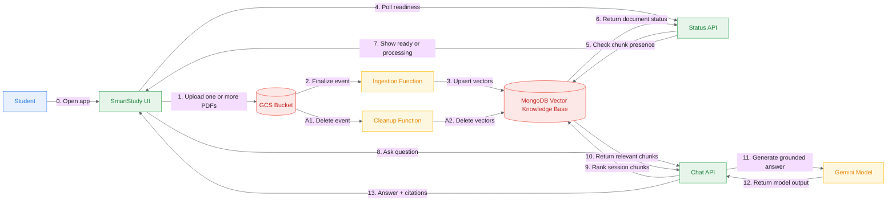

# SmartStudy Architecture - High-Level Overview

Last updated: 2026-04-27

This is the quick, non-technical view of what the system does today.

## Big Picture

SmartStudy is an AI tutor that lets a student upload lecture PDFs, then ask questions grounded in those documents.

## Main User Journey

1. Student selects one or more PDFs and uploads them in one batch from the UI.
2. The upload gateway deduplicates exact-content repeats, replaces older same-title versions, and stores only needed new files under the session-scoped bucket folder.
3. An ingestion function automatically processes each PDF:
   - reads text
   - chunks text
   - creates embeddings
   - stores vectors in MongoDB
4. UI polls document status and shows per-file readiness in the interface.
5. Student asks a question in chat.
6. Chat API retrieves context from MongoDB for the active session only:
   - normal questions rank only that session's stored chunk vectors
   - `/quiz` samples a broader set of indexed chunks for grounded quiz generation
7. Gemini generates an answer with citations.
8. UI displays answer + sources.

## Main Features Already Working

- Cloud-native upload pipeline from UI to GCS.
- Batch multi-PDF upload from one UI action.
- Session-scoped upload paths in GCS (`uploads/<sid>/...`) to isolate study materials.
- Per-session upload deduplication by SHA-256 content hash and normalized filename versioning.
- Automatic ingestion from GCS events.
- Live per-document readiness notifications in UI via session document polling.
- Documents tab restored on refresh for the same session URL (`sid`).
- Documents can be removed from the current session directly from the Documents tab.
- Grounded Q&A with source citations.
- Short social prompts and no-context questions return without document citations.
- Sources expander summaries are filtered to inline citations, so retrieved-but-unused documents are not shown as references.
- Dedicated `/quiz` mode that builds quizzes from sampled indexed chunks instead of searching for the literal `/quiz` string.
- Conversation memory restored on refresh or reopen for the same session URL (`sid`).
- Automatic cleanup of vectors when PDFs are deleted from GCS.

## Why This Architecture Is Good for the Project

- It is event-driven and automated (no manual ingestion step for normal use).
- It follows RAG design principles (retrieve first, then generate).
- It is modular:
  - UI (Streamlit)
  - API/orchestration (Flask + LangChain)
  - ingestion/cleanup (Cloud Functions)
  - storage/search (MongoDB Atlas)
- It matches the project requirements for cloud automation, retrieval, and tutor persona.

## Current Deployed Endpoints

- UI: `https://smartstudy-ui-959221029360.europe-west1.run.app`
- Chat API: `https://smartstudy-chat-api-959221029360.europe-west1.run.app`

## Current Limitations (Known)

- Session continuity depends on keeping the same `sid` in the URL; opening a new or different session starts with empty chat and empty Documents state.
- If multiple PDFs are active, citation lists may show multiple files by design.
- The ingestion function still runs a bucket-to-Mongo reconciliation safety scan after uploads; acceptable for project scale, but not ideal for very large corpora.
- Upload deduplication is exact-content based; visually similar PDFs with different bytes are treated as different content.
- User authentication and strict user identity isolation are not enabled yet; current isolation is session-based.

## Next Evolution (When Needed)

- Better multi-document controls (for example select active docs without deleting them).
- Authenticated user identity mapped to session/document scope.
