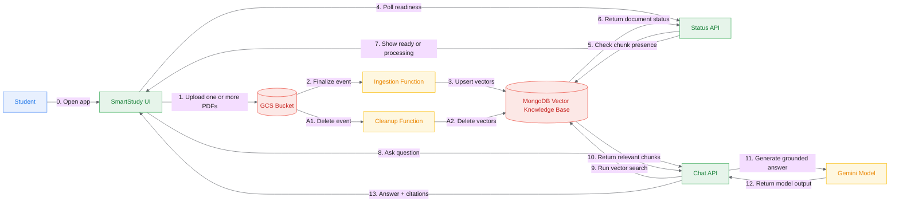

# SmartStudy Architecture - High-Level Overview

Last updated: 2026-04-01

This is the quick, non-technical view of what the system does today.

## Big Picture

SmartStudy is an AI tutor that lets a student upload lecture PDFs, then ask questions grounded in those documents.

## Main User Journey

1. Student selects one or more PDFs and uploads them in one batch from the UI.
2. Each file is stored in the cloud bucket with a unique object name.
3. An ingestion function automatically processes each PDF:
   - reads text
   - chunks text
   - creates embeddings
   - stores vectors in MongoDB
4. UI polls document status and shows per-file readiness in the interface.
5. Student asks a question in chat.
6. Chat API retrieves relevant chunks from MongoDB.
7. Gemini generates an answer with citations.
8. UI displays answer + sources.

## Main Features Already Working

- Cloud-native upload pipeline from UI to GCS.
- Batch multi-PDF upload from one UI action.
- Automatic ingestion from GCS events.
- Live per-document readiness notifications in UI via status polling.
- Vector search on MongoDB Atlas.
- Grounded Q&A with source citations.
- Quiz command support in tutor prompt (`/quiz`).
- Automatic cleanup of vectors when PDFs are deleted from GCS.

## Why This Architecture Is Good for the Project

- It is event-driven and automated (no manual ingestion step for normal use).
- It follows RAG design principles (retrieve first, then generate).
- It is modular:
  - UI (Streamlit)
  - API/orchestration (Flask + LangChain)
  - ingestion/cleanup (Cloud Functions)
  - storage/search (MongoDB Atlas)
- It matches the project requirements for cloud automation, retrieval, and tutor persona.

## Current Deployed Endpoints

- UI: `https://smartstudy-ui-omcgx7zncq-ew.a.run.app`
- Chat API: `https://smartstudy-chat-api-omcgx7zncq-ew.a.run.app`

## Current Limitations (Known)

- Refreshing the page resets the local UI chat transcript (backend history exists but is not fully rehydrated into UI yet).
- If multiple PDFs are active, citation lists may show multiple files by design.

## Next Evolution (When Needed)

- Persistent frontend session identity across refresh.
- Better document management UI (list/delete/select active docs).
- Per-user document isolation and filtering.
