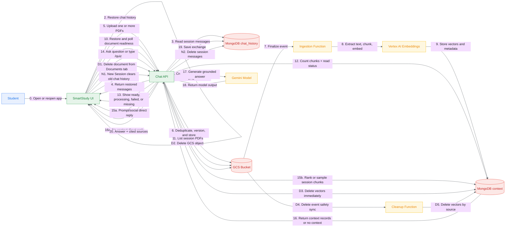

# SmartStudy Architecture - High-Level Overview

Last updated: 2026-05-05

This is the quick, non-technical view of what the system does today.

## Where to Read More

| Need | Read |
|---|---|
| Setup commands and repository-level usage | [Project README](../README.md) |
| Transition from the lab baseline to this project | [Lab-to-project transition](lab-to-project-transition.md) |
| Developer runbook, deployment wiring, and exact processing paths | [Architecture developer deep dive](architecture-dev.md) |
| Streamlit UI behavior | [Streamlit README](../streamlit_app/README.md) |
| Chat API endpoints and RAG behavior | [Chat API README](../chat_api/README.md) |
| Cloud Function ingestion, cleanup, and CloudEvent handling | [Cloud Function README](../cloud_function/README.md) |

## Big Picture

SmartStudy is an AI tutor that lets a student upload lecture PDFs, then ask questions grounded in those documents.

```mermaid
%%{init: {"theme":"base","themeVariables":{"primaryTextColor":"#202124","lineColor":"#5F6368","fontFamily":"Arial"}}}%%
flowchart LR
    A[Student] -->|0. Open or reopen app| B[SmartStudy UI]
    B -->|1. Create or restore sid in URL| B

    B -->|2. Restore chat history| X[Chat API]
    X -->|3. Read session messages| Y[(MongoDB chat_history)]
    X -->|4. Return restored messages| B

    B -->|5. Upload one or more PDFs| X
    X -->|6. Deduplicate, version, and store| C[(GCS Bucket)]
    C -->|7. Finalize event| G[Ingestion Function]
    G -->|8. Extract text, chunk, embed| V[Vertex AI Embeddings]
    V -->|9. Store vectors and metadata| D[(MongoDB context)]

    B -->|10. Restore and poll document readiness| X
    X -->|11. List session PDFs| C
    X -->|12. Count chunks + read status| D
    X -->|13. Show ready, processing, failed, or missing| B

    B -->|14. Ask question or type /quiz| X
    X -->|15a. Prompt/social direct reply| B
    X -->|15b. Rank or sample session chunks| D
    D -->|16. Return context records or no context| X
    X -->|16a. No-context direct reply| B
    X -->|17. Generate grounded answer| E[Gemini Model]
    E -->|18. Return model output| X
    X -->|19. Save exchange| Y
    X -->|20. Answer + cited sources| B

    B -->|D1. Delete document from Documents tab| X
    X -->|D2. Delete GCS object| C
    X -->|D3. Delete vectors immediately| D
    C -->|D4. Delete event safety sync| H[Cleanup Function]
    H -->|D5. Delete vectors by source| D

    B -->|N1. New Session clears old chat history| X
    X -->|N2. Delete session messages| Y

    classDef user fill:#E8F0FE,stroke:#4285F4,color:#1A73E8,stroke-width:1px;
    classDef service fill:#E6F4EA,stroke:#34A853,color:#188038,stroke-width:1px;
    classDef compute fill:#FEF7E0,stroke:#FBBC05,color:#EA8600,stroke-width:1px;
    classDef data fill:#FCE8E6,stroke:#EA4335,color:#C5221F,stroke-width:1px;

    class A user;
    class B,X service;
    class G,H,V,E compute;
    class C,D,Y data;
```

## Main User Stories

The step numbers match the diagram above.

### Open or Reopen a Session

0. Student opens the Streamlit app.
1. The UI creates a new `sid` or restores the `sid` already present in the URL.
2. The UI asks the Chat API for saved chat history.
3. The Chat API reads the session's messages from MongoDB `chat_history`.
4. The UI renders the restored conversation.

### Upload and Prepare PDFs

5. Student uploads one or more PDFs from the sidebar.
6. The Chat API deduplicates exact-content repeats, replaces older same-title versions, and stores only needed new files under `uploads/<sid>/...` in GCS.
7. Each new GCS object emits a finalize event.
8. The ingestion function extracts text, chunks it, and creates embeddings.
9. The function stores chunk vectors and metadata in MongoDB `context`.

### Show Document Readiness

10. The UI restores and refreshes the Documents tab through the Chat API.
11. The Chat API lists PDFs only from the active session folder in GCS.
12. The Chat API counts indexed chunks for those object paths in MongoDB.
13. The UI shows each document as ready, processing, failed, missing, or invalid. Image-only/scanned PDFs with no extractable text are marked failed with an actionable message, and stalled mixed-content PDFs are marked failed after the processing timeout.

### Ask Questions or Generate Quizzes

14. Student asks a normal question or types `/quiz`.
15. Prompt-disclosure attempts and short social prompts return direct source-free replies before retrieval; otherwise the Chat API retrieves session context.
16. Normal questions rank only the active session's stored chunk vectors; `/quiz` samples indexed chunks from the same session. If no useful context is available, the API returns a direct source-free no-context answer.
17. Gemini generates an answer grounded in the returned context.
18. Gemini returns model output to the Chat API.
19. The Chat API stores the exchange in chat history.
20. The UI displays the answer and only the sources cited in the answer.

### Delete or Start Fresh

D1. Student deletes a document from the Documents tab.
D2. The Chat API deletes the matching GCS object.
D3. The Chat API immediately deletes the matching vectors from MongoDB.
D4-D5. The cleanup function also handles the GCS delete event as an event-driven safety sync.
N1-N2. New Session clears the old chat history and switches the UI to a fresh `sid`; old session PDFs remain isolated under their old `sid` until explicitly deleted.

## Main Features Already Working

- Cloud-native upload pipeline from UI through the Chat API to GCS.
- Batch multi-PDF upload from one UI action.
- Session-scoped upload paths in GCS (`uploads/<sid>/...`) to isolate study materials.
- Per-session upload deduplication by SHA-256 content hash and normalized filename versioning.
- Automatic ingestion from GCS events.
- User-facing failed status for corrupted, unsupported, scanned, image-only PDFs, or stalled mixed-content PDFs that never produce indexed chunks.
- Live per-document readiness notifications in UI via session document polling.
- Documents tab restored on refresh for the same session URL (`sid`).
- Documents can be removed from the current session directly from the Documents tab.
- Grounded Q&A with source citations.
- Prompt-disclosure attempts are blocked before retrieval or model generation.
- Short social prompts and no-context questions return without document citations.
- Sources expander summaries are filtered to inline citations, so retrieved-but-unused documents are not shown as references.
- Dedicated `/quiz` mode that builds quizzes from sampled indexed chunks instead of searching for the literal `/quiz` string.
- Conversation memory restored on refresh or reopen for the same session URL (`sid`).
- Immediate vector deletion for UI-initiated document removals, plus automatic cleanup when PDFs are deleted from GCS.

## Why This Architecture Is Good for the Project

- It is event-driven and automated (no manual ingestion step for normal use).
- It follows RAG design principles (retrieve first, then generate).
- It is modular:
  - UI (Streamlit)
  - API/orchestration (Flask + LangChain)
  - ingestion/cleanup (Cloud Functions)
  - storage/retrieval (MongoDB Atlas context storage plus API-side cosine ranking)
- It matches the project requirements for cloud automation, retrieval, and tutor persona.

## Current Deployed Endpoints

- UI: `https://smartstudy-ui-959221029360.europe-west1.run.app`
- Chat API: `https://smartstudy-chat-api-959221029360.europe-west1.run.app`

## Current Limitations (Known)

- Session continuity depends on keeping the same `sid` in the URL; opening a new or different session starts with empty chat and empty Documents state.
- New Session clears the old chat history and switches to a fresh `sid`, but it does not delete old-session PDFs or vectors.
- If multiple PDFs are active, citation lists may show multiple files by design.
- The ingestion function still runs a bucket-to-Mongo reconciliation safety scan after uploads; acceptable for project scale, but not ideal for very large corpora.
- Upload deduplication is exact-content based; visually similar PDFs with different bytes are treated as different content.
- User authentication and strict user identity isolation are not enabled yet; current isolation is session-based.

## Next Evolution (When Needed)

- Better multi-document controls (for example select active docs without deleting them).
- Authenticated user identity mapped to session/document scope.
