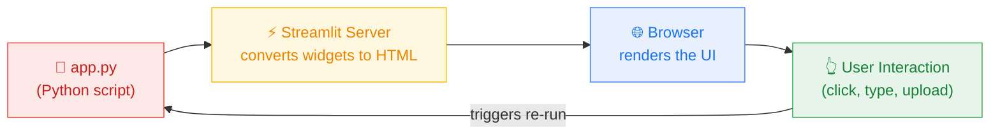
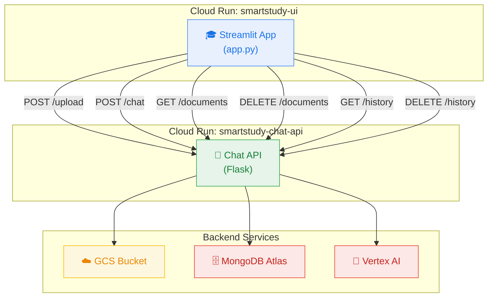
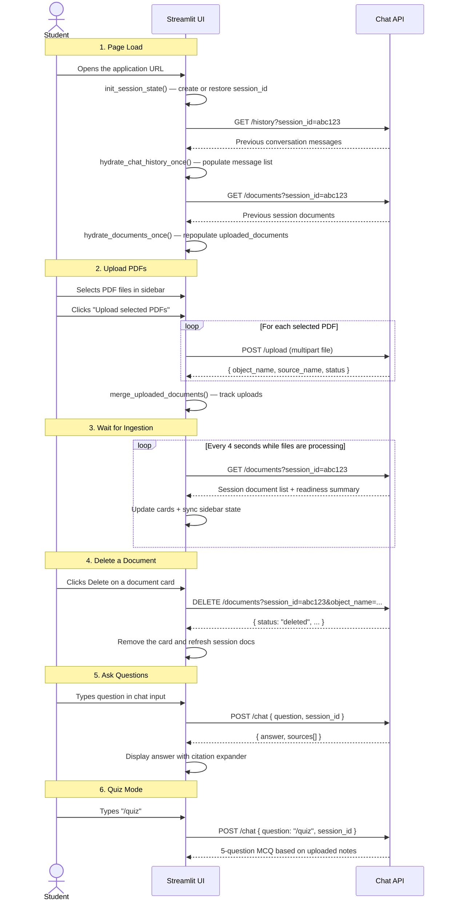
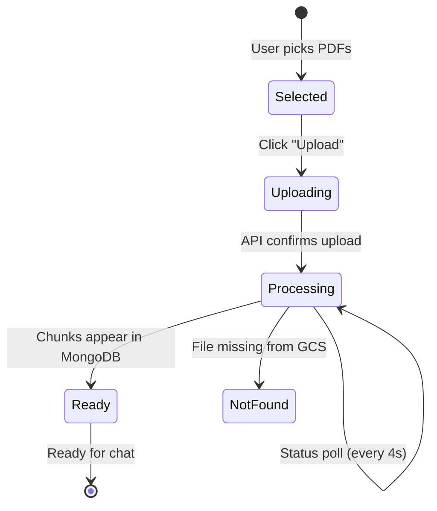
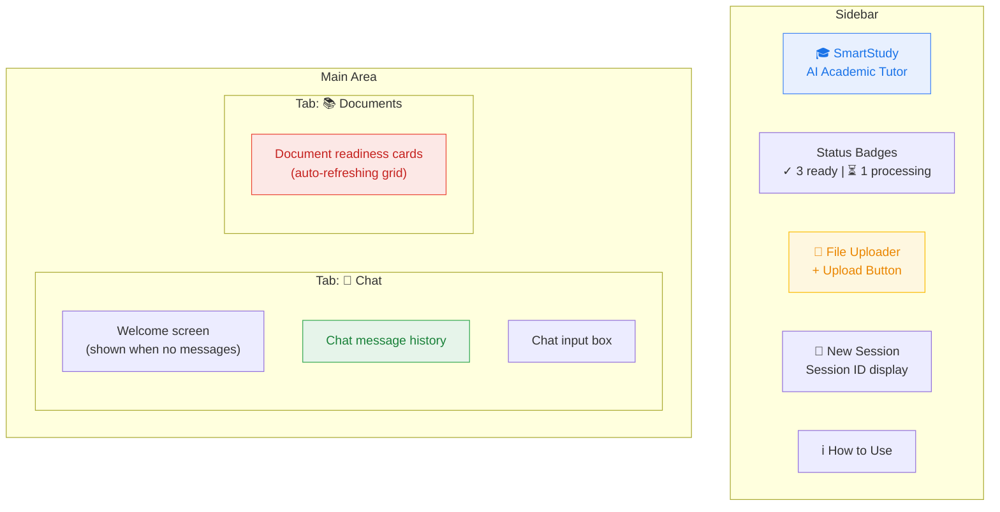

# 🎓 Streamlit App — Cloud-Hosted Interactive Frontend

## What Is Streamlit?

**Streamlit** is a Python framework that turns data scripts into interactive web applications — with no HTML, CSS, or JavaScript required. You write Python, and Streamlit generates a reactive web UI automatically.

In a typical web stack, you'd need a frontend framework (React, Angular), a build pipeline, and separate backend APIs. Streamlit collapses all of that into a single Python file: every time the user interacts with a widget, Streamlit re-runs the script from top to bottom, updating the page.



This makes Streamlit perfect for data-centric applications, dashboards, and — in our case — an AI tutor interface that needs file upload, real-time status polling, and a chat conversation.

---

## Why Deploy Streamlit on Cloud Run?

Streamlit apps are typically run locally with `streamlit run app.py`. But for a cloud computing project, we need the app to be accessible from anywhere, with no installation required. **Cloud Run** makes this possible:

| Local Development | Cloud Run Deployment |
|---|---|
| `streamlit run app.py` on your laptop | Docker container served at a public HTTPS URL |
| Only you can access it | Anyone with the URL can use it |
| You manage the process | Google manages scaling, TLS, and uptime |
| No redundancy | Cloud Run restarts crashed containers automatically |

The Streamlit app runs as a containerized Cloud Run service, just like the Chat API. The key difference is the process: instead of Gunicorn serving Flask, the container runs `streamlit run` directly:

```dockerfile
FROM python:3.12-slim
WORKDIR /app
COPY requirements.txt .
RUN pip install --no-cache-dir -r requirements.txt
COPY . .
CMD ["streamlit", "run", "app.py",
     "--server.port=8501",
     "--server.address=0.0.0.0",
     "--server.headless=true"]
```

The `--server.headless=true` flag disables the "open browser" prompt that Streamlit normally shows — since in a container, there is no browser to open.

---

## How the UI Communicates with the Backend

The Streamlit app is a **pure frontend** — it contains no database connections, no AI model calls, and no direct GCS access. Everything goes through the Chat API via HTTP:



This separation is a fundamental cloud architecture principle: the **frontend knows nothing about the infrastructure**. It only knows how to talk to one URL (`CHAT_API_URL`), and the Chat API handles all the complexity behind the scenes.

---

## User Journey Through the Application

Here's the complete flow a student experiences, mapped to what happens in the code:



---

## Application Structure — The Main Code Flows

### Session Management

Every user session gets a unique `session_id` (UUID). This ID is:
- Stored in Streamlit's `st.session_state`
- Mirrored to the browser URL as `?sid=...`
- Sent with every API request to maintain conversation continuity and document isolation

```python
def init_session_state():
    query_session_id = read_query_session_id()
    if "session_id" not in st.session_state:
        st.session_state.session_id = query_session_id or str(uuid.uuid4())
```

If you copy the URL and open it in another tab, or close and reopen that same `?sid=...` link later, you get the same conversation and the same session-scoped Documents list. If you click "New Session", a fresh UUID is generated and both chat and document state reset.

### History Rehydration

On page load, the app calls `GET /history` exactly once to restore previous messages:

```python
def hydrate_chat_history_once():
    if st.session_state.history_hydrated:
        return
    response = requests.get(
        f"{CHAT_API_URL}/history",
        params={"session_id": st.session_state.session_id},
    )
    # ... populate st.session_state.messages
    st.session_state.history_hydrated = True
```

The `history_hydrated` flag ensures we don't reload history on every Streamlit re-run (which happens on every interaction). If the history request fails, the flag stays unset so a later rerun can retry instead of treating the failed restore as complete.

### Document Rehydration

On that same page load, the app calls `GET /documents` exactly once to restore the current session's uploaded files:

```python
def hydrate_documents_once():
    if st.session_state.documents_hydrated:
        return
    response = requests.get(
        f"{CHAT_API_URL}/documents",
        params={"session_id": st.session_state.session_id},
    )
    # ... populate st.session_state.uploaded_documents
    st.session_state.documents_hydrated = True
```

This is what keeps the Documents tab populated after a browser refresh or reopen for the same `sid`.

### File Upload Flow

The sidebar contains a file uploader widget. When the user clicks "Upload selected PDFs":

1. Each file is sent individually to `POST /upload` via `requests.post`, together with the active `session_id`
2. The API may upload a new object, reuse an exact duplicate already in the session, or replace an older same-title version
3. Successful results are tracked in `st.session_state.uploaded_documents`
4. The UI immediately starts polling `GET /documents` for ingestion status



### Automatic Status Polling with Fragments

While any document is still processing, the UI uses Streamlit's **fragment** feature to auto-refresh the session document list every 4 seconds:

```python
@fragment(run_every=STATUS_POLL_INTERVAL_SECONDS)
def document_status_fragment():
    if has_pending_documents():
        poll_document_statuses()
    render_document_status_panel()
```

The UI compares a stable document-state signature and only triggers a full app rerun when a meaningful status change happens. That keeps the sidebar badges, chat welcome subtitle, and Documents tab in sync without constant unnecessary reruns.

### Document Deletion

Each document card includes a `Delete` button. When the user clicks it:

1. The UI calls `DELETE /documents` with the active `session_id` and the card's `object_name`.
2. The backend removes the PDF from the session-scoped GCS folder and deletes the matching indexed chunks.
3. The UI refreshes `GET /documents` and removes the card from the current session state.

### Chat Interaction

The chat uses Streamlit's `st.chat_input` and `st.chat_message` components:

```python
if prompt := st.chat_input(placeholder):
    # 1. Add user message to local state
    st.session_state.messages.append({"role": "user", "content": prompt})

    # 2. Send to Chat API
    response = requests.post(f"{CHAT_API_URL}/chat", json={
        "question": prompt,
        "session_id": st.session_state.session_id,
    })

    # 3. Display answer with sources
    data = response.json()
    st.markdown(data["answer"])
```

An important detail: **error messages are never saved to chat history**. If the API is unreachable, the error is displayed with `st.error()` but not appended to `st.session_state.messages`. This prevents "Error: connection refused" from showing up as a permanent assistant message.

The UI also filters the Sources expander against the assistant answer before display. If an API response contains a retrieved source that is not cited inline, the expander hides it instead of presenting it as a used reference.

---

## UI Layout

The app uses a **two-tab layout** with a sidebar:



- **Sidebar** — brand, upload controls, session management
- **Chat tab** — full-screen conversational interface
- **Documents tab** — grid of status cards showing ingestion progress per file

---

## Streamlit Session State — Managing Reactivity

Streamlit re-runs the entire script on every interaction. To persist data across re-runs, we use `st.session_state` — a per-user dictionary that survives re-runs:

| State Key | Purpose |
|---|---|
| `messages` | List of `{role, content, sources?}` dicts — the conversation |
| `session_id` | UUID identifying this conversation session |
| `history_hydrated` | Boolean flag — have we loaded history from the API yet? |
| `documents_hydrated` | Boolean flag — have we restored the session's document list yet? |
| `uploaded_documents` | List of upload metadata dicts with status info |
| `upload_feedback` | Success/warning/error message from the last upload batch |
| `document_feedback` | Success/warning/error message from document deletion |
| `uploader_key` | Counter that resets the file uploader widget after upload |
| `document_status_error` | Last error from status polling (if any) |

Without `st.session_state`, every variable would be lost on every button click. This is the core mechanism that makes Streamlit apps feel stateful despite the re-run model.

---

## Custom Theming with CSS

Streamlit's default appearance is functional but generic. The app injects custom CSS via `st.markdown(unsafe_allow_html=True)` to create a polished, branded experience:

- **CSS custom properties** (`--ss-accent`, `--ss-border`, etc.) for consistent theming
- **Document status cards** with animated pulse indicators for processing state
- **Chat message styling** with rounded corners and subtle shadows
- **Responsive grid** for document cards that adapts to screen width
- **Rise animation** for newly appearing elements

All styling is defined in the `render_theme()` function at the top of the render cycle.

---

## File Structure

```
streamlit_app/
├── app.py               # The entire Streamlit application (single file)
├── requirements.txt     # Python dependencies (streamlit, requests)
└── Dockerfile           # Container definition for Cloud Run
```

The app is deliberately kept as a single file. Streamlit apps are scripts, and keeping everything in `app.py` makes the execution flow easy to follow from top to bottom.

---

## Deployment Configuration

```
Service:     smartstudy-ui
Platform:    Cloud Run (fully managed)
Region:      europe-west1
Image:       Built from streamlit_app/Dockerfile
URL:         https://smartstudy-ui-959221029360.europe-west1.run.app
Port:        8501 (Streamlit default)
```

The only environment variable the UI needs is `CHAT_API_URL` — the internal URL of the Chat API service. Everything else is handled by the Chat API.

---

## Key Cloud Concepts Demonstrated

| Concept | How It Appears Here |
|---|---|
| **Containerized frontend** | Streamlit app packaged in Docker, served by Cloud Run |
| **Service-to-service calls** | UI communicates with Chat API via HTTP `requests` library |
| **Decoupled frontend** | UI has zero knowledge of MongoDB, GCS, or Vertex AI |
| **Serverless auto-scaling** | Cloud Run scales UI instances independently from the API |
| **Managed HTTPS** | Cloud Run provides TLS-terminated public URLs automatically |
| **Reactive programming model** | Streamlit's re-run-on-interaction pattern |
| **Partial page updates** | Fragments enable auto-polling without full re-runs |
| **Session state management** | `st.session_state` persists data across Streamlit re-runs |
| **URL-based session sharing** | `?sid=...` query parameter enables shareable session links |
| **Graceful error handling** | Network errors displayed to user but never persisted as chat history |
